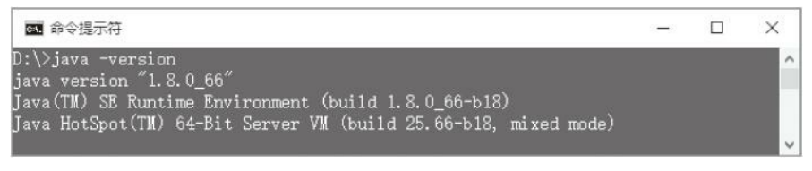
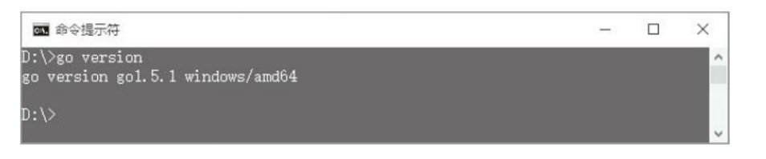
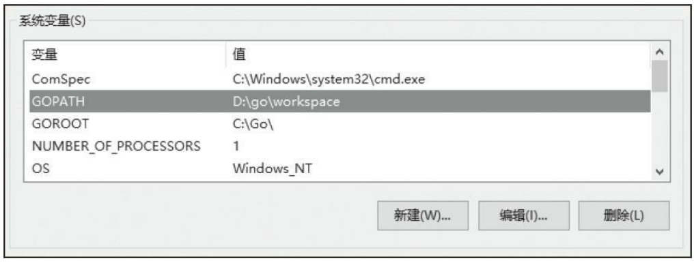
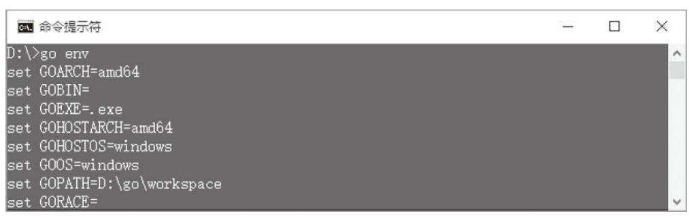
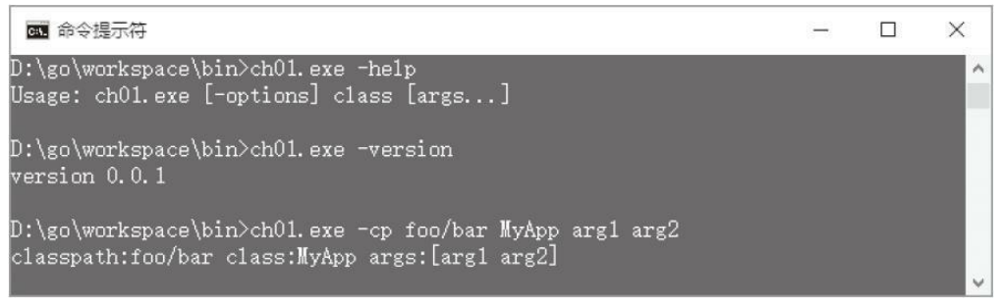

第1章 命令行工具 
====

Java虚拟机非常复杂，要想真正理解它的工作原理，最好的方式就是自己动手写一个。本书的目的就是带领读者按照Java虚拟机规范 [1] ，从零开始，一步一步用Go语言实现一个功能逐步增强的Java虚拟机。第1章将编写一个类似java [2] 的命令行工具，用它来启动我们自己的虚拟机。在开始编写代码之前，需要先准备好开发环境。   

本书假定读者使用的是Windows操作系统，因此书中出现的命令和路径等都是Windows形式的。如果读者使用的是其他操作系统（如Mac OS X、Linux等），需要根据自己的情况做出相应调整。由于Go和Java都是跨平台语言，所以本书代码在常见的操作系统中都可以正常编译和运行。   

[1]: 如无特殊说明，本书中出现的“Java虚拟机规范”均指《Java虚拟机规范第8版》，网址为http://docs.oracle.com/javase/specs/jvms/se8/html/index.html。  
[2]: 后文中，首字母小写的java特指java命令行工具。 
#### 1.1 准备工作 
##### 1.1.1 安装JDK 
我们都知道，要想运行Java程序，只有Java虚拟机是不够的，还需要有Java类库。Java虚拟机和Java类库一起，构成了Java运行时环境。本书编写的Java虚拟机依赖于JDK类库，另外，编译本书中的Java示例代码也需要JDK。从Oracle网站[1]上下载最新版本（写作本章时是8u66）的JDK安装文件，双击运行即可。安装完毕之后，打开命令行窗口执行`java -version`命令，如果看到类似图1-1所示的输出，就证明安装成功了。

图1-1 java-version命令输出 

[1]: http://www.oracle.com/technetwork/java/javase/downloads/index.html。
##### 1.1.2 安装Go 
从Go语言官网[1]下载最新版本（写作本章时是1.5.1）的Go安装文件，双击运行即可。安装完毕之后，打开命令行窗口执行`go version`命令，如果看到类似图1-2所示的输出，就证明安装成功了。

图1-2 go version命令输出 

`go`[2]命令是Go语言提供的命令行工具，用来管理Go源代码。go命令就像瑞士军刀，里面包含了各种小工具。用Go语言编写程序，基本上只需要go命令就可以了。go命令里的小工具是各种子命令，version是其中之一。其他常用的子命令包括help、fmt、install和test等。  

go命令行工具希望所有的Go源代码被都放在一个工作空间中。所谓工作空间，实际上就是一个目录结构，这个目录结构包含三个子目录。  
- src目录中是Go语言源代码。 
- pkg目录中是编译好的包对象文件。 
- bin目录中是链接好的可执行文件。 

实际上只有src目录是必须要有的，go会自动创建pkg和bin目录。工作空间可以位于任何地方，本书使用`D:\go\workspace`作为工作空间。那么go如何知道工作空间在哪里呢？答案是通过`GOPATH`环境变量。在桌面上右键单击“我的电脑”图标，在弹出的菜单中单击“属性”，然后单击“高级系统设置”；在“系统属性”对话框中单击“环境变量”按钮，然后添加GOPATH变量即可，如图1-3所示。

图1-3 设置GOPATH环境变量

打开命令行窗口，执行go env命令，如果看到类似图1-4所示的输出，GOPATH环境变量就设置成功了。

图1-4 使用go env命令查看GOPATH环境变量

[1]:  https://golang.org/dl/（如果Go官网无法访问，可以从http://golangtc.com/download）下载。
[2]: 后文中，首字母小写的go特指go命令行工具。
##### 1.1.3 创建目录结构 
Go语言以包为单位组织源代码，包可以嵌套，形成层次关系。本书编写的Go源文件全部放在jvmgo包中，其中每一章的源文件又分别放在自己的子包中。包层次和目录结构有一个简单的对应关系，比如，第1章的代码在jvmgo\ch01目录下。除第1章以外，每一章都是先复制前一章代码，然后进行修改和完善。每一章的代码都是独立的，可以单独编译为一个可执行文件。下面创建第1章的目录结构。  

在D：\go\workspace\src（也就是%GOPATH%\src）目录下创建jvmgo目录，在jvmgo目录下创建ch01目录。现在，工作空间的目录结构如下： 
```text
D:\go\workspace\src 
  |-jvmgo 
    |-ch01
```

#### 1.2 java命令
::: tip
Java虚拟机的工作是运行Java应用程序。和其他类型的应用程序一样，Java应用程序也需要一个入口点，这个入口点就是我们熟知的main（）方法。如果一个类包含main（）方法，这个类就可以用来启动Java应用程序，我们把这个类叫作主类。最简单的Java程序是只有一个main（）方法的类，如著名的HelloWorld程序。 
:::

```java
public class HelloWorld { 
    public static void main(String[] args) { 
        System.out.println("Hello, world!"); 
    } 
} 
```


那么Java虚拟机如何知道我们要从哪个类启动应用程序呢？对此，Java虚拟机规范没有明确规定。也就是说，是由虚拟机实现自行决定的。比如Oracle的Java虚拟机实现是通过java命令来启动的，主类名由命令行参数指定。java命令有如下4种形式：
```shell script
java [-options] class [args] 
java [-options] -jar jarfile [args] 
javaw [-options] class [args] 
javaw [-options] -jar jarfile [args] 
```
可以向java命令传递三组参数：选项、主类名（或者JAR文件名）和main（）方法参数。选项由减号（–）开头。通常，第一个非选项参数给出主类的完全限定名（fully qualified class name）。但是如果用户提供了–jar选项，则第一个非选项参数表示JAR文件名，java命令必须从这个JAR文件中寻找主类。javaw命令和java命令几乎一样，唯一的差别在于，javaw命令不显示命令行窗口，因此特别适合用于启动GUI（图形用户界面）应用程序。 

选项可以分为两类：标准选项和非标准选项。标准选项比较稳定，不会轻易变动。非标准选项以-X开头，很有可能会在未来的版本中变化。非标准选项中有一部分是高级选项，以-XX开头。表1-1列出了java命令常用的选项及其用途。 [1] 
 
表1-1 java命令常用选项及其用途 

[1]: 完整的java命令用法请参考http://docs.oracle.com/javase/8/docs/technotes/tools/windows/java.html。

#### 1.3 编写命令行工具 
开发环境已经准备就绪，java命令也已经介绍完毕，相信读者已经迫不及待想开始写代码了吧！下面根据java命令的第一种用法，自己动手编写一个类似的命令行工具。
 
先定义一个结构体来表示命令行选项和参数。在ch01目录下创建cmd.go文件 [1] ，用你喜欢的文本编辑器 [2] 打开它，然后在其中定义Cmd结构体，代码如下：
``` go
package main 
import "flag" 
import "fmt" 
import "os" 
type Cmd struct { 
    helpFlag bool 
    versionFlag bool 
    cpOption string 
    class string 
    args []string 
}
```
在Java语言中，API一般以类库的形式提供。在Go语言中，API则是以包（package）的形式提供。包可以向用户提供常量、变量、结构体以及函数等。Java内置了丰富的类库，Go也同样内置了功能强大的包。本章将用到fmt、os和flag包。

os包定义了一个Args变量，其中存放传递给命令行的全部参数。如果直接处理os.Args变量，需要写很多代码。还好Go语言内置了flag包，这个包可以帮助我们处理命令行选项。有了flag包，我们的工作就简单了很多。继续编辑cmd.go文件，在其中定义parseCmd（）函数[3] ，代码如下：
```go
func parseCmd() *Cmd { 
    cmd := &Cmd{} 
    flag.Usage = printUsage 
    flag.BoolVar(&cmd.helpFlag, "help", false, "print help message") 
    flag.BoolVar(&cmd.helpFlag, "?", false, "print help message") 
    flag.BoolVar(&cmd.versionFlag, "version", false, "print version and exit") 
    flag.StringVar(&cmd.cpOption, "classpath", "", "classpath") 
    flag.StringVar(&cmd.cpOption, "cp", "", "classpath") 
    flag.Parse() 
    args := flag.Args() 
    if len(args) > 0 { 
        cmd.class = args[0] 
        cmd.args = args[1:] 
    }
    return cmd 
}
```
首先设置flag.Usage变量，把printUsage（）函数赋值给它；然后调用flag包提供的各种Var（）函数设置需要解析的选项；接着调用Parse（）函数解析选项。如果Parse（）函数解析失败，它就调用printUsage（）函数把命令的用法打印到控制台。printUsage（）函数的代码如下：
```go
func printUsage() {
    fmt.Printf("Usage: %s [-options] class [args...]\n", os.Args[0]) 
}
```

如果解析成功，调用flag.Args（）函数可以捕获其他没有被解析的参数。其中第一个参数就是主类名，剩下的是要传递给主类的参数。这样，用了不到40行代码，我们的命令行工具就编写完了。下面来测试它。 

[1]: Go源文件一般以.go作为后缀，文件名全部小写，多个单词之间用下划线分隔。Go语言规范要求Go源文件必须使用UTF-8编码，详见https://golang.org/ref/spec。 
[2]: 笔者推荐Sublime2，主页为http://www.sublimetext.com/。 
[3]: Go语言有函数（Function）和方法（Method）之分，方法调用需要receiver，函数调用则不需要。

#### 1.4 测试本章代码
 
在ch01目录下创建main.go文件，然后输入下面的代码。
```go
package main 
import "fmt" 
func main() { 
    cmd := parseCmd() 
    if cmd.versionFlag { 
        fmt.Println("version 0.0.1") 
    } else if cmd.helpFlag || cmd.class == "" { 
        printUsage() 
    } else {
        startJVM(cmd) 
    } 
} 
```
注意，与cmd.go文件一样，main.go文件的包名也是main。在Go语言中，main是一个特殊的包，这个包所在的目录（可以叫作任何名字）会被编译为可执行文件。Go程序的入口也是main（）函数，但是不接收任何参数，也不能有返回值。 

main（）函数先调用ParseCommand（）函数解析命令行参数，如果一切正常，则调用startJVM（）函数启动Java虚拟机。如果解析出现错误，或者用户输入了-help选项，则调用PrintUsage（）函数打印出帮助信息。如果用户输入了-version选项，则输出（一个滥竽充数的）版本信息。因为我们还没有真正开始编写Java虚拟机，所以startJVM（）函数暂时只是打印一些信息而已，代码如下： 
```go
func startJVM(cmd *Cmd) { 
    fmt.Printf("classpath:%s class:%s args:%v\n", 
    cmd.cpOption, cmd.class, cmd.args) 
} 
```
打开命令行窗口，执行下面的命令编译本章代码。 
```shell script
go install jvmgo\ch01 
```
命令执行完毕后，如果没有看到任何输出就证明编译成功了，此时在D：\go\workspace\bin目录下会出现ch01.exe文件。现在，可以用各种参数进行测试。笔者的测试结果如图1-5所示。 

图1-5 ch01.exe测试结果
#### 1.5 本章小结 
本章准备好了开发环境，学习了java命令的基本用法，并且编写了一个简化版的命令行工具。虽然还没有正式开始编写Java虚拟机，但是已经打好了坚实的基础。下一章将深入了解-classpath选项，探讨Java虚拟机从哪里寻找class文件，并实现class文件加载功能。

