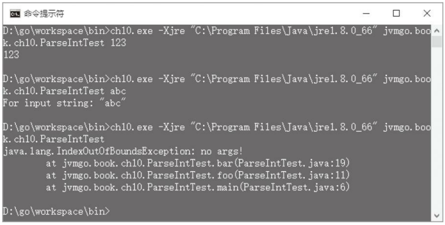

第10章 异常处理 
---

异常处理是Java语言非常重要的一个语法，本章从Java虚拟机的角度来讨论异常是如何被抛出和处理的。开始本章之前，还是先把目录结构准备好。复制ch09目录，改名为ch10。修改main.go等文件，把import语句中的ch09全都替换成ch10。本章对目录结构没有太大的调整。

#### 10.1 异常处理概述 

在Java语言中，异常可以分为两类：Checked异常和Unchecked异常。Unchecked异常包括java.lang.RuntimeException、java.lang.Error以及它们的子类，其他异常都是Check -ed异常。所有异常都最终继承自java.lang.Throwable。如果一个方法有可能导致Checked异常抛出，则该方法要么需要捕获该异常并妥善处理，要么必须把该异常列在自己的throws子句中，否则无法通过编译。Unchecked异常没有这个限制。请注意，Java虚拟机规范并没有这个规定，这只是Java语言的语法规则。 

异常可以由Java虚拟机抛出，也可以由Java代码抛出。当Java虚拟机在运行过程中遇到比较严重的问题时，会抛出java.lang.Error的某个子类，如StackOverflowError、OutOfMemoryError等。程序一般无法从这种异常里恢复，所以在代码中通常也不必关心这类异常。一部分指令在执行过程中会导致Java虚拟机抛出java.lang.RuntimeException的某个子类，如NullPointerException、IndexOutOfBoundsException等。这类异常一般是代码中的bug导致的，需要格外注意。在代码中抛出和处理异常是由athrow指令和方法的异常处理表配合完成的，本章将重点讨论这一点。 

在Java 6之前，Oracle的Java编译器使用jsr、jsr_w和ret指令来实现finally子句。从Java 6开始，已经不再使用这些指令，本章不讨论这三条指令。

#### 10.2 异常抛出

在Java代码中，异常是通过throw关键字抛出的。Java虚拟机规范的3.12节给了一个例子，代码如下：

```java
void cantBeZero(int i) { 
    if (i == 0) { 
        throw new TestExc(); 
    } 
} 
```
上面的方法编译之后，产生下面的字节码：
```
0 iload_1 // 把参数 1(i)推入操作数栈顶 
1 ifne 12 // 如果i不等于 0，直接执行return指令 
4 new #2 // 创建 TestExc实例，把引用推入操作数栈顶 
7 dup // 复制 TestExc实例引用 
8 invokespecial #3 // 调用TestExc构造函数(栈顶引用已经作为参数弹出) 
11 athrow // 抛出异常 
12 return // 方法返回 
```
唯一陌生的指令是athrow，将在10.4节实现该指令。从字节码来看，异常对象似乎也只是普通的对象，通过new指令创建，然后调用构造函数进行初始化。这是真的吗？如果查看java.lang.Exception或RuntimeException的源代码就可以知道，这并不是真的。它们的构造函数都调用了超类java.lang.Throwable的构造函数。Throwable的构造函数又调用了fillInStackTrace()方法记录Java虚拟机栈信息，这个方法的代码如下： 
```java
// java.lang.Throwable 
public synchronized Throwable fillInStackTrace() { 
    if (stackTrace != null || 
        backtrace != null /* Out of protocol state */ ) { 
        fillInStackTrace(0); 
        stackTrace = UNASSIGNED_STACK; 
    }
    return this; 
} 
```

fillInStackTrace()是用Java写的，必须借助另外一个本地方法才能访问Java虚拟机栈，这个方法就是重载后的fillInStackTrace(int)方法，代码如下：
```java
private native Throwable fillInStackTrace(int dummy); 
```

也就是说，要想抛出异常，Java虚拟机必须实现这个本地方法。在10.5节中，我们会真正实现这个方法，这里先给它一个空的实现。在ch10\native\java\lang目录下创建Throw -able.go文件，在其中注册fillInStackTrace(int)方法，代码如下：
```go
package lang 
import "jvmgo/ch10/native" 
import "jvmgo/ch10/rtda" 
import "jvmgo/ch10/rtda/heap" 
func init() { 
    native.Register("java/lang/Throwable", "fillInStackTrace", "(I)Ljava/lang/Throwable;", fillInStackTrace) 
}
// private native Throwable fillInStackTrace(int dummy); 
func fillInStackTrace(frame *rtda.Frame) { // 在 10.5节实现 
}
```
异常抛出暂时先讨论到这里，下面介绍如何处理异常。
#### 10.3 异常处理表 
异常处理是通过try-catch句实现的，还是参考Java虚拟机规范的3.12节，里面有一个例子，代码如下：
```java
void catchOne() { 
    try {
        tryItOut(); 
    } catch (TestExc e) { 
        handleExc(e); 
    } 
}
```
上面的方法编译之后，产生下面的字节码：
```
1 aload_0 // 把局部变量0(this)推入操作数栈顶 
2 invokevirtual #4 // 调用tryItOut()方法 
4 goto 13 // 如果try{}没有抛出异常，直接执行return指令 
7 astore_1 // 否则，异常对象引用在操作数栈顶，把它弹出，并放入局部变量1
8 aload_0 // 把this推入栈顶(将作为handleExc()方法的参数0)
9 aload_1 // 把异常对象引用推入栈顶(将作为handleExc()方法的参数1) 
10 invokevirtual #5 // 调用handleExc()方法 
13 return // 方法返回 
```
从字节码来看，如果没有异常抛出，则会直接goto到return指令，方法正常返回。那么如果有异常抛出，goto和return之间的指令是如何执行的呢？答案是查找方法的异常处理表。异常处理表是Code属性的一部分，它记录了方法是否有能力处理某种异常。回顾一下方法的Code属性，它的结构如下：
```go
Code_attribute { 
    u2 attribute_name_index; 
    u4 attribute_length; 
    u2 max_stack; 
    u2 max_locals; 
    u4 code_length; 
    u1 code[code_length]; 
    u2 exception_table_length; 
    { 
        u2 start_pc; 
        u2 end_pc; 
        u2 handler_pc; 
        u2 catch_type; 
    } exception_table[exception_table_length]; 
    u2 attributes_count;
    attribute_info attributes[attributes_count]; 
}
```
异常处理表的每一项都包含3个信息：处理哪部分代码抛出的异常、哪类异常，以及异常处理代码在哪里。具体来说，start_pc和end_pc可以锁定一部分字节码，这部分字节码对应某个可能抛出异常的try{}代码块。catch_type是个索引，通过它可以从运行时常量池中查到一个类符号引用，解析后的类是个异常类，假定这个类是X。如果位于start_pc和end_pc之间的指令抛出异常x，且x是X(或者X的子类)的实例，handler_pc就指出负责异常处理的catch{}块在哪里。 
回到catchOne()方法，它的异常处理表只有如下一项：
 
当tryItOut()方法通过athrow指令抛出TestExc异常时，Java虚拟机首先会查找tryItOut()方法的异常处理表，看它能否处理该异常。如果能，则跳转到相应的字节码开始异常处理。假设tryItOut()方法无法处理异常，Java虚拟机会进一步查看它的调用者，也就是catchOne()方法的异常处理表。catchOne()方法刚好可以处理TestExc异常，使catch{}块得以执行。 
假设catchOne()方法也无法处理TestExc异常，Java虚拟机会继续查找catchOne()的调用者的异常处理表。这个过程会一直继续下去，直到找到某个异常处理项，或者到达Java虚拟机栈的底部。把这部分逻辑放在athrow指令中，具体请看10.4小节。下面修改Method结构体，在里面增加异常处理表。 
打开ch10\rtda\heap\method.go文件，给Method结构体添加exceptionTable字段，代码如下： 
```go
type Method struct { 
    ... // 其他字段 
    exceptionTable ExceptionTable 
}
```
然后修改copyAttributes()方法，从Code属性中复制异常处理表，代码如下：
```go
func (self *Method) copyAttributes(cfMethod *classfile.MemberInfo) { 
    if codeAttr := cfMethod.CodeAttribute(); codeAttr != nil { 
        ... // 其他字段 
        self.exceptionTable = newExceptionTable(codeAttr.ExceptionTable(), 
        self.class.constantPool) 
    }
}
```
稍后再介绍ExceptionTable类型和newExceptionTable()函数。继续编辑method.go文件，给Method结构体添加FindExceptionHandler()方法，代码如下：
```go
func (self *Method) FindExceptionHandler(exClass *Class, pc int) int { 
    handler := self.exceptionTable.findExceptionHandler(exClass, pc) 
    if handler != nil { 
        return handler.handlerPc 
    }
    return -1 
}
```
FindExceptionHandler()方法调用ExceptionTable.findExceptionHandler()方法搜索异常处理表，如果能够找到对应的异常处理项，则返回它的handlerPc字段，否则返回–1。Method结构体修改完毕，下面来看ExceptionTable。
在ch10\rtda\heap目录下创建exception_table.go文件，在其中定义ExceptionTable类型，代码如下：
```go
package heap 
import "jvmgo/ch10/classfile" 
type ExceptionTable []*ExceptionHandler 

ExceptionTable只是[]*ExceptionHandler的别名而已，ExceptionHandler的定义如下：
type ExceptionHandler struct { 
    startPc int 
    endPc int 
    handlerPc int 
    catchType *ClassRef 
}
```
这4个字段在前面已经介绍过，这里不多解释。继续编辑exception_table.go文件，在其中实现newExceptionTable()函数，代码如下：
```go
func newExceptionTable(entries []*classfile.ExceptionTableEntry,cp *ConstantPool) ExceptionTable { 
    table := make([]*ExceptionHandler, len(entries)) 
    for i, entry := range entries { 
        table[i] = &ExceptionHandler{ 
            startPc: int(entry.StartPc()), 
            endPc: int(entry.EndPc()), 
            handlerPc: int(entry.HandlerPc()), 
            catchType: getCatchType(uint(entry.CatchType()), cp), 
        } 
    }
    return table 
}
```
newExceptionTable()函数把class文件中的异常处理表转换成ExceptionTable类型。有一点需要特别说明：异常处理项的catchType有可能是0。我们知道0是无效的常量池索引，但是在这里0并非表示catch-none，而是表示catch-all，它的用法马上就会看到。get -CatchType()函数从运行时常量池中查找类符号引用，代码如下：
```go
func getCatchType(index uint, cp *ConstantPool) *ClassRef { 
    if index == 0 { 
        return nil 
    }
    return cp.GetConstant(index).(*ClassRef) 
}
```
继续编辑exception_table.go文件，实现findExceptionHandler()方法，代码如下：
```go
func (self ExceptionTable) findExceptionHandler(exClass *Class, pc int) *ExceptionHandler { 
    for _, handler := range self { 
        if pc >= handler.startPc && pc < handler.endPc { 
            if handler.catchType == nil { 
                return handler // catch-all 
            }
            catchClass := handler.catchType.ResolvedClass() 
            if catchClass == exClass || catchClass.IsSuperClassOf(exClass) { 
                return handler 
            } 
        } 
    }
    return nil 
}
```
异常处理表查找逻辑前面已经描述过，此处不再赘述。这里注意两点。第一，startPc给出的是try{}语句块的第一条指令，endPc给出的则是try{}语句块的下一条指令。第二，如果catchType是nil(在class文件中是0)，表示可以处理所有异常，这是用来实现finally子句的。为了节约篇幅，本章就不再讨论多个catch块、嵌套try-catch，以及finally子句等对应的字节码实现了，读者可以阅读Java虚拟机规范的3.12节。下一节将实现athrow指令。
#### 10.4 实现athrow指令 
athrow属于引用类指令，在ch10\instructions\references目录下创建athrow.go文件，在其中定义athrow指令，代码如下：
```go
package references 
import "reflect" 
import "jvmgo/ch10/instructions/base" 
import "jvmgo/ch10/rtda" 
import "jvmgo/ch10/rtda/heap" 
// Throw exception or error 
type ATHROW struct{ base.NoOperandsInstruction } 

athrow指令的操作数是一个异常对象引用，从操作数栈弹出。 Execute()方法的代码如下：
```go
func (self *ATHROW) Execute(frame *rtda.Frame) { 
    ex := frame.OperandStack().PopRef() 
    if ex == nil { 
        panic("java.lang.NullPointerException") 
    }
    thread := frame.Thread() 
    if !findAndGotoExceptionHandler(thread, ex) { 
        handleUncaughtException(thread, ex) 
    } 
}
```
先从操作数栈中弹出异常对象引用，如果该引用是null，则抛出NullPointerException异常，否则看是否可以找到并跳转到异常处理代码。findAndGotoExceptionHandler()函数的代码如下：
```go
func findAndGotoExceptionHandler(thread *rtda.Thread, ex *heap.Object) bool { 
    for {
        frame := thread.CurrentFrame() 
        pc := frame.NextPC() - 1 
        handlerPC := frame.Method().FindExceptionHandler(ex.Class(), pc) 
        if handlerPC > 0 { 
            stack := frame.OperandStack() 
            stack.Clear() 
            stack.PushRef(ex) 
            frame.SetNextPC(handlerPC) 
            return true 
        }
        thread.PopFrame() 
        if thread.IsStackEmpty() { 
            break 
        } 
    }
    return false 
}
```
从当前帧开始，遍历Java虚拟机栈，查找方法的异常处理表。假设遍历到帧F，如果在F对应的方法中找不到异常处理项，则把F弹出，继续遍历。反之如果找到了异常处理项，在跳转到异常处理代码之前，要先把F的操作数栈清空，然后把异常对象引用推入栈顶。OperandStack结构体的Clear()方法是新增加的，后面给出它的代码。

如果遍历完Java虚拟机栈还是找不到异常处理代码，则handleUncaughtException()函数打印出Java虚拟机栈信息，代码如下：
```go
func handleUncaughtException(thread *rtda.Thread, ex *heap.Object) {
    thread.ClearStack() 
    jMsg := ex.GetRefVar("detailMessage", "Ljava/lang/String;") 
    goMsg := heap.GoString(jMsg) 
    println(ex.Class().JavaName() + ": " + goMsg) 
    stes := reflect.ValueOf(ex.Extra()) 
    for i := 0; i < stes.Len(); i++ { 
        ste := stes.Index(i).Interface().(interface { 
            String() string 
        })
        println("\tat " + ste.String()) 
    } 
} 
```
handleUncaughtException()函数把Java虚拟机栈清空，然后打印出异常信息。由于Java虚拟机栈已经空了，所以解释器也就终止执行了。上面的代码使用Go语言的reflect包打印Java虚拟机栈信息。可以猜到，异常对象的extra字段中存放的就是Java虚拟机栈信息，那么这个extra字段是什么时候设置的呢？10.5节会揭晓答案。 

前面的代码中还有几个方法没有介绍，现在依次给出它们的代码。
OperandStack结构体的Clear()方法如下：
```go
func (self *OperandStack) Clear() { 
    self.size = 0 
    for i := range self.slots { 
        self.slots[i].ref = nil 
    } 
}
```
Thread结构体的ClearStack()方法如下： 
```go
func (self *Thread) ClearStack() {
    self.stack.clear() 
}
```
它调用了Stack结构体的clear()方法，代码如下：
```go
func (self *Stack) clear() { 
    for !self.isEmpty() { 
        self.pop() 
    } 
}
```
athrow指令实现后，还需要修改ch10\instructions\factory.go文件，在NewInstruc -tion()函数中增加athrow指令的case语句，为了节约篇幅这里就不给出代码了。
#### 10.5 Java虚拟机栈信息 
回到ch10\native\java\lang\Throwable.go文件，在其中定义StackTraceElement结构体，代码如下：
```go
type StackTraceElement struct { 
    fileName string 
    className string 
    methodName string 
    lineNumber int 
}
```
StackTraceElement结构体用来记录Java虚拟机栈帧信息：lineNumber字段给出帧正在执行哪行代码；methodName字段给出方法名；className字段给出声明方法的类名；fileName字段给出类所在的文件名。下面实现java.lang.Throwable的fillInStackTrace()本地方法，代码如下： 
```go
// private native Throwable fillInStackTrace(int dummy); 
func fillInStackTrace(frame *rtda.Frame) { 
    this := frame.LocalVars().GetThis() 
    frame.OperandStack().PushRef(this) 
    stes := createStackTraceElements(this, frame.Thread()) 
    this.SetExtra(stes) 
}
```
重点在createStackTraceElements()函数里，代码如下：
```go
func createStackTraceElements(tObj *heap.Object, thread *rtda.Thread) []*StackTraceElement { 
    skip := distanceToObject(tObj.Class()) + 2 
    frames := thread.GetFrames()[skip:] 
    stes := make([]*StackTraceElement, len(frames)) 
    for i, frame := range frames { 
        stes[i] = createStackTraceElement(frame) 
    }
    return stes 
}
```
这个函数需要解释一下。由于栈顶两帧正在执行fillInStackTrace(int)和fillInStackTrace()方法，所以需要跳过这两帧。这两帧下面的几帧正在执行异常类的构造函数，所以也要跳过，具体要跳过多少帧数则要看异常类的继承层次。distanceToObject()函数计算所需跳过的帧数，代码如下：
```go
func distanceToObject(class *heap.Class) int { 
    distance := 0 
    for c := class.SuperClass(); c != nil; c = c.SuperClass() { 
        distance++ 
    }
    return distance 
}
```
计算好需要跳过的帧之后，调用Thread结构体的GetFrames()方法拿到完整的Java虚拟机栈，然后reslice一下就是真正需要的帧。GetFrames()方法只是调用了Stack结构体的getFrames()方法，代码如下：
```go
func (self *Thread) GetFrames() []*Frame {
    return self.stack.getFrames() 
}
```
下面是getFrames()方法的代码。 
```go
func (self *Stack) getFrames() []*Frame { 
    frames := make([]*Frame, 0, self.size) 
    for frame := self._top; frame != nil; frame = frame.lower { 
        frames = append(frames, frame) 
    }
    return frames 
}
```
createStackTraceElement()函数根据帧创建StackTraceElement实例，代码如下：
```go
func createStackTraceElement(frame *rtda.Frame) *StackTraceElement { 
    method := frame.Method() 
    class := method.Class() 
    return &StackTraceElement{ 
        fileName: class.SourceFile(), 
        className: class.JavaName(), 
        methodName: method.Name(), 
        lineNumber: method.GetLineNumber(frame.NextPC() - 1), 
    } 
}
```
最后实现Class结构体的SourceFile()方法和Method结构体的GetLineNumber()方法。打开class.go，给Class结构体添加sourceFile字段，代码如下：
```go
type Class struct { 
    ... // 其他字段
    sourceFile string 
}
```
SourceFile()是getter方法，这里就不给出代码了。接下来需要修改newClass()函数，从class文件中读取源文件名，改动如下：
```go
func newClass(cf *classfile.ClassFile) *Class { 
    class := &Class{} 
    ... // 其他代码 
    class.sourceFile = getSourceFile(cf) 
    return class 
}
```
在3.4.3节讨论过，源文件名在ClassFile结构的属性表中，getSourceFile()函数提取这个信息，代码如下：
```go
func getSourceFile(cf *classfile.ClassFile) string { 
    if sfAttr := cf.SourceFileAttribute(); sfAttr != nil { 
        return sfAttr.FileName() 
    }
    return "Unknown" 
}
```
注意，并不是每个class文件中都有源文件信息，这个因编译时的编译器选项而异。Class结构体改完了，下面修改Method结构体。打开method.go，给Method结构体添加lineNumberTable字段，改动如下：

```go
type Method struct { 
    ... // 其他字段 
    lineNumberTable *classfile.LineNumberTableAttribute 
} 
```
然后修改copyAttributes()方法，从class文件中提取行号表，代码如下：
```go
func (self *Method) copyAttributes(cfMethod *classfile.MemberInfo) { 
    if codeAttr := cfMethod.CodeAttribute(); codeAttr != nil { 
        self.maxStack = codeAttr.MaxStack() 
        self.maxLocals = codeAttr.MaxLocals() 
        self.code = codeAttr.Code() 
        self.lineNumberTable = codeAttr.LineNumberTableAttribute() 
        self.exceptionTable = newExceptionTable(codeAttr.ExceptionTable(), 
        self.class.constantPool) 
    } 
}
```
最后添加GetLineNumber()方法，代码如下：
```go
func (self *Method) GetLineNumber(pc int) int { 
    if self.IsNative() { 
        return -2 
    }
    if self.lineNumberTable == nil { 
        return -1 
    }
    return self.lineNumberTable.GetLineNumber(pc) 
}
``` 
和源文件名一样，并不是每个方法都有行号表。如果方法没有行号表，自然也就查不到pc对应的行号，这种情况下返回–1。本地方法没有字节码，这种情况下返回–2。剩下的情况调用LineNumberTableAttribute结构体的GetLineNumber()方法查找行号，代码如下：
```go
func (self *LineNumberTableAttribute) GetLineNumber(pc int) int { 
    for i := len(self.lineNumberTable) - 1; i >= 0; i-- { 
        entry := self.lineNumberTable[i] 
        if pc >= int(entry.startPc) { 
            return int(entry.lineNumber) 
        } 
    }
    return -1 
}
```
上面的代码在classfile\attr_line_number_table.go文件中，行号表的更多信息请参考3.4.7节。
#### 10.6 测试本章代码 
打开命令行窗口，执行下面的命令编译本章代码。
```shell script
go install jvmgo\ch10 
```
命令执行完毕后，在D：\go\workspace\bin目录下出现ch10.exe文件。运行ch10.exe，测试下面的Java程序。 
```java
package jvmgo.book.ch10; 
public class ParseIntTest { 
    public static void main(String[] args) { 
        foo(args); 
    }
    private static void foo(String[] args) { 
        try {
            bar(args); 
        } catch (NumberFormatException e) { 
            System.out.println(e.getMessage()); 
        } 
    }
    private static void bar(String[] args) { 
        if (args.length == 0) { 
            throw new IndexOutOfBoundsException("no args!"); 
        }
        int x = Integer.parseInt(args[0]); 
        System.out.println(x); 
    } 
} 
```
笔者使用不同的参数进行测试，结果如图10-1所示。
 
图10-1 ParseIntTest程序测试结果
#### 10.7 本章小结 
本章讨论了异常抛出和处理、异常处理表、athrow指令等，下一章将讨论类加载器。
```
