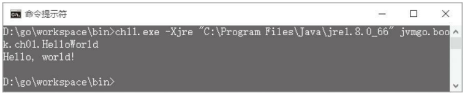

第11章 结束 
---
在第7章讨论了方法调用和返回，在第8章讨论了数组和字符串。经过整整8章的努力之后，“Hello，World！”终于出现在了控制台上。不过比较遗憾的是，由于java.lang.System类还没有被正确初始化，直接调用System.out.println（）方法会导致NullPointerException异常抛出。为此修改了invokevirtual指令，对println（）方法做了特殊处理。本章将弥补这个遗憾，把这个hack从代码中删除，让Java虚拟机可以真正在控制台上打印数字和字符串。 

本章也是本书的最后一章，在结尾会对全书内容进行简要回顾。开始本章之前，还是先把目录结构准备好。复制ch10目录，改名为ch11。修改main.go等文件，把import语句中的ch10全都替换成ch11。本章对目录结构没有太大的调整。

#### 11.1 System类是如何被初始化的 
大家都知道，System类有3个公开的静态常量：out、err和in。其中out和err用于向标准输出流和标准错误流中写入信息，in用于从标准输入流中读取信息。那么这3个常量是在哪里被赋值的呢？看一下System类的源代码：
```java
// java.lang.System 
public final class System { 
    public final static InputStream in = null; 
    public final static PrintStream out = null; 
    public final static PrintStream err = null; 
    /* register the natives via the static initializer. 
    *
    * VM will invoke the initializeSystemClass method to complete 
    * the initialization for this class separated from clinit. 
    * Note that to use properties set by the VM, see the constraints 
    * described in the initializeSystemClass method. 
    */ 
    private static native void registerNatives(); 
    static { 
        registerNatives(); 
    }
    ... // 其他代码 
}
```
从注释可知，System类的初始化过程分为两个阶段。第一个阶段由类初始化方法完成，在这个方法中registerNatives（）方法会注册其他本地方法。第二个阶段由VM完成，在这个阶段VM会调用System.initializeSystemClass()方法。那么initializeSystemClass()方法究竟干了些什么呢？这个方法很长，而且有很详细的注释。去掉与本节讨论无关的代码和注释之后，它的代码如下：
```go
/**
* Initialize the system class. Called after thread initialization. 
*/ 
private static void initializeSystemClass() { 
    ... // 其他代码 
    FileInputStream fdIn = new FileInputStream(FileDescriptor.in); 
    FileOutputStream fdOut = new FileOutputStream(FileDescriptor.out); 
    FileOutputStream fdErr = new FileOutputStream(FileDescriptor.err); 
    setIn0(new BufferedInputStream(fdIn)); 
    setOut0(newPrintStream(fdOut,props.getProperty("sun.stdout.encoding"))); 
    setErr0(newPrintStream(fdErr,props.getProperty("sun.stderr.encoding"))); 
    ... // 其他代码 
}
```
可见in、out和err正是在这里设置的。再来看sun.misc.VM类的源代码（VM类属于Oracle私有代码，并没有开源，下面是反编译后的Java代码）：
```java
// sun.misc.VM 
public class VM { 
    ... // 其他代码 
    static { 
        ... // 其他代码 
        initialize(); 
    }
    private static native void initialize(); 
}
```
VM类在初始化时调用了initialize（）方法。虽然initialize（）是本地方法，但是可以推测正是这个方法调用了System.initializeSystemClass（）方法。是否真的是这样笔者就不做考证了，下面修改解释器，让System类可以正确初始化。
#### 11.2 初始化System类 
先打开ch11\instructions\references\invokevirtual.go文件，修改invokevirtual指令的Execute（）方法，把其中的hack代码删掉。由于只是删除代码，这里就不做详细说明了。 

接下来打开ch11\native\sun\misc\VM.go文件，删除heap包的导入语句。原来的initialize（）方法也是用hack方式实现的，需要重写，代码如下：
```go
// private static native void initialize(); 
func initialize(frame *rtda.Frame) { 
    classLoader := frame.Method().Class().Loader() 
    jlSysClass := classLoader.LoadClass("java/lang/System") 
    initSysClass := jlSysClass.GetStaticMethod("initializeSystemClass", "()V") 
    base.InvokeMethod(frame, initSysClass) 
}
```
新的实现只是调用了System.initializeSystemClass（）方法而已。下面修改解释器，让它在执行主类的main（）方法之前先调用VM.initialize（）方法。为了让代码的可读性更好，将对main.go文件进行比较大的调整。打开ch11\main.go，把下面的代码复制进去：
```go
package main 
func main() { 
    cmd := parseCmd()if cmd.versionFlag { 
        println("version 0.0.1") 
    } else if cmd.helpFlag || cmd.class == "" { 
        printUsage() 
    } else { 
        newJVM(cmd).start() 
    } 
} 
```
主要逻辑都被挪到了（新增加的）ch11\jvm.go文件中，代码如下：
```go
package main 
import "fmt" 
import "strings" 
import "jvmgo/ch11/classpath" 
import "jvmgo/ch11/instructions/base" 
import "jvmgo/ch11/rtda" 
import "jvmgo/ch11/rtda/heap" 
type JVM struct { 
    cmd *Cmd 
    classLoader *heap.ClassLoader 
    mainThread *rtda.Thread 
}
func newJVM(cmd *Cmd) *JVM {...} 
func (self *JVM) start() {...}
```
newJVM（）函数创建JVM结构体实例，代码如下：
```go
func newJVM(cmd *Cmd) *JVM { 
    cp := classpath.Parse(cmd.XjreOption, cmd.cpOption) 
    classLoader := heap.NewClassLoader(cp, cmd.verboseClassFlag) 
    return &JVM{ 
        cmd: cmd, 
        classLoader: classLoader, 
        mainThread: rtda.NewThread(), 
    } 
}
```
start（）方法先初始化VM类，然后执行主类的main（）方法，代码如下：
```go
func (self *JVM) start() { 
    self.initVM() 
    self.execMain() 
}
```
initVM（）先加载sun.mis.VM类，然后执行其类初始化方法，代码如下：
```go
func (self *JVM) initVM() { 
    vmClass := self.classLoader.LoadClass("sun/misc/VM") 
    base.InitClass(self.mainThread, vmClass) 
    interpret(self.mainThread, self.cmd.verboseInstFlag) 
}
```
execMain（）方法先加载主类，然后执行其main（）方法，代码如下：
```go
func (self *JVM) execMain() { 
    className := strings.Replace(self.cmd.class, ".", "/", -1) 
    mainClass := self.classLoader.LoadClass(className) 
    mainMethod := mainClass.GetMainMethod() 
    if mainMethod == nil { 
    fmt.Printf("Main method not found in class %s\n", self.cmd.class) 
        return 
    }
    argsArr := self.createArgsArray() 
    frame := self.mainThread.NewFrame(mainMethod) 
    frame.LocalVars().SetRef(0, argsArr) // 给 main()方法传递 args参数
    self.mainThread.PushFrame(frame) 
    interpret(self.mainThread, self.cmd.verboseInstFlag) 
}
```
execMain（）方法的前半部分代码是从main.go文件中拷贝过来的，我们已经比较熟悉了。后半部分代码需要解释的一点是：在调用main（）方法之前，需要给它传递args参数，这是通过直接操作局部变量表实现的。createArgsArray（）方法把Go的[]string变量转换成Java的字符串数组，代码是从interpreter.go文件中拷贝过来的，如下所示：
```go
func (self *JVM) createArgsArray() *heap.Object { 
    stringClass := self.classLoader.LoadClass("java/lang/String") 
    argsLen := uint(len(self.cmd.args)) 
    argsArr := stringClass.ArrayClass().NewArray(argsLen) 
    jArgs := argsArr.Refs() 
    for i, arg := range self.cmd.args { 
        jArgs[i] = heap.JString(self.classLoader, arg) 
    }
    return argsArr 
}
```
jvm.go文件改好了，下面修改interpret（）函数。打开ch11\interpreter.go，删除heap包的导入语句和createArgsArray（）函数，然后修改interpret（）函数，代码如下：
```go
func interpret(thread *rtda.Thread, logInst bool) { 
    defer catchErr(thread) 
    loop(thread, logInst)
}
```
修改之后interpret（）函数简单了许多，直接调用loop（）函数进入循环即可。至此，解释器修改完毕。这就是本章要写的全部代码吗?并不是。为了正常执行System.initialize -SystemClass（）以及System.out.println（）等方法，还需要实现很多Java类库中的本地方法。为了节约篇幅，这里就不一一列举了，请读者阅读随书源代码。下面以System.out. println（String）为例解释字符串是如何被打印到控制台的，其他类型变量的打印原理同字符串类似。
#### 11.3 System.out.println（）是如何工作的 
回到System.initializeSystemClass（）方法，进一步省略之后，其代码如下：
```go
// java.lang.System 
public final static PrintStream out = null; 
private static void initializeSystemClass() { 
    ... // 其他代码 
    FileOutputStream fdOut = new FileOutputStream(FileDescriptor.out); 
    setOut0(newPrintStream(fdOut,props.getProperty("sun.stdout.encoding"))); 
    ... // 其他代码 
} 
```
setOut0（）是个本地方法，代码如下：
```go
private static native void setOut0(PrintStream out); 
```
newPrintStream（）方法的代码如下：
```go
private static PrintStream newPrintStream(FileOutputStream fos, String enc) { 
    if (enc != null) { 
        try {
            return new PrintStream(new BufferedOutputStream(fos, 128), true, enc); 
        } catch (UnsupportedEncodingException uee) {} 
    }
    return new PrintStream(new BufferedOutputStream(fos, 128), true); 
}
```
由代码可知，System.out常量是PrintStream类型，它内部包装了一个BufferedOutput -Stream实例。BufferedOutputStream内部又包装了一个FileOutputStream实例。Java的io类库使用了装饰器模式，调用System.out.println（String）方法之后，经过层层包装，最后到达FileOutputStream类的writeBytes（）方法。这个方法无法用Java代码实现，所以是个本地方法，其代码如下：
```java
// java.io.FileOutputStream 
public class FileOutputStream extends OutputStream { 
    ... // 其他代码 
    private native void writeBytes(byte b[], int off, int len, boolean append) 
        throws IOException; 
    }
```
System.setOut0（）本地方法在ch11\native\java\lang\System.go文件中实现，代码如下：
```go
// private static native void setOut0(PrintStream out); 
func setOut0(frame *rtda.Frame) { 
    out := frame.LocalVars().GetRef(0) 
    sysClass := frame.Method().Class() 
    sysClass.SetRefVar("out", "Ljava/io/PrintStream;", out) 
}
```
FileOutputStream.writeBytes（）本地方法在ch11\native\java\io\FileOutput -Stream.go文件中实现，代码如下：
```go
// private native void writeBytes(byte b[], int off, int len, boolean append) 
// throws IOException; 
func writeBytes(frame *rtda.Frame) { 
    vars := frame.LocalVars() 
    //this := vars.GetRef(0) 
    b := vars.GetRef(1) 
    off := vars.GetInt(2) 
    len := vars.GetInt(3) 
    //append := vars.GetBoolean(4) 
    jBytes := b.Data().([]int8) 
    goBytes := castInt8sToUint8s(jBytes) 
    goBytes = goBytes[off : off+len] 
    os.Stdout.Write(goBytes) 
}
```
虽然同是字节类型，但是在Java语言中byte是有符号类型，在Go语言中byte则是无符号类型。所以这里需要先把Java的字节数组转换成Go的[]byte变量，然后再调用os.Std -out.Write（）方法把它写到控制台。castInt8sToUint8s（）函数代码如下：
```go
func castInt8sToUint8s(jBytes []int8) (goBytes []byte) { 
    ptr := unsafe.Pointer(&jBytes) 
    goBytes = *((*[]byte)(ptr)) 
    return 
}
```
如果读者属于完美主义者，很容易会发现这里的小瑕疵：FileOutputStream应该可以处理任何文件而不仅仅是标准输出。没错，不过本章就到此为止了，感兴趣的读者可以继续完善代码，让FileOutputStream可以支持任何文件。下面测试本章代码。
#### 11.4 测试本章代码 
打开命令行窗口，执行下面的命令编译本章代码：
```shell script
go install jvmgo\ch11 
```

命令执行完毕后，在D：\go\workspace\bin目录下出现ch11.exe文件。用ch11.exe测试HelloWorld程序，结果如图11-1所示。
 
图11-1 HelloWorld程序执行结果
#### 11.5 总结 
本书共11章，各章内容如下： 
第1章讨论了Java虚拟机是如何启动的，介绍了java命令的用法，并且实现了一个类似的命令行工具。 

第2、第3、第6、第8章讨论了类加载器。其中第2章讨论了Java虚拟机如何搜索class文件，并且实现了类路径，可以把class文件读到内存中。第3章讨论了class文件结构体，并且实现了class文件解析，把难以理解的字节序列转换成了ClassFile结构体。第6章实现了一个简化版的类加载器，进一步处理ClassFile结构体，把它转换成Class结构体放入方法区。第8章对类加载器进行了扩展，使其可以加载数组类。 

第4、第6章讨论了运行时数据区。其中第4章主要讨论了线程私有的运行时数据区，包括Java虚拟机栈、帧、局部变量表和操作数栈等。第6章主要讨论了线程共享的运行时数据区，包括方法区和运行时常量池等。

第7、第9、第10章讨论了方法调用。其中第7章主要讨论了Java方法的调用和返回，并且实现了相关指令。第9章讨论了本地方法调用，并且实现了Java类库中一些最重要的本地方法。第10章讨论了异常处理，并且实现了athrow指令。 

第5章编写了一个简单的解释器，从这一章开始，我们陆续实现了约200条指令。在Java虚拟机规范已经定义的205条指令中，只剩下8条还没有实现，分别是：控制指令中的jsr和ret；扩展指令中的jsr_w；引用类指令中的invokedynamic、monitorenter和monitorexit；以及保留指令中的breakpoint和impldep2。 

不过遗憾的是，有很多重要的内容没有讨论：class文件验证、内存管理和垃圾回收、类加载器的委派模型、多线程、JIT，等等。如果本书有机会出第2版，希望可以涵盖这些内容。


```
