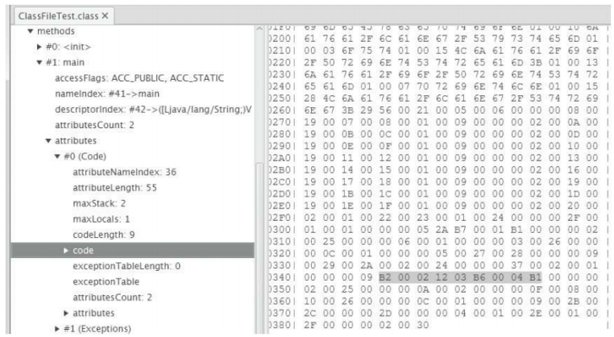
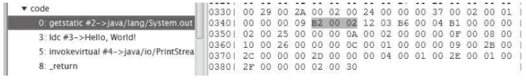
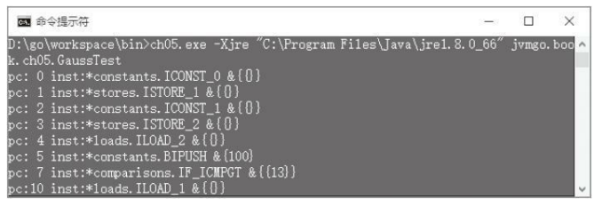
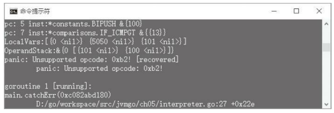

第5章 指令集和解释器  
----
由第3章可知，编译之后的Java方法以字节码的形式存储在class文件中。在第4章中，初步实现了Java虚拟机栈、帧、操作数栈和局部变量表等运行时数据区。本章将在前两章的基础上编写一个简单的解释器，并且实现大约150条指令。在后面的章节中，会不断改进这个解释器，让它可以执行更多的指令。 

在开始阅读本章之前，先把本章的目录结构准备好。复制ch04目录，改名为ch05。修改main.go等文件，把import语句中的ch04都改成ch05。在ch05目录中创建instructions子目录。现在我们的目录结构看起来应该是下面这样：
```
D:\go\workspace\src 
|-jvmgo 
|-ch01 ~ ch04 
|-ch05 
|-classfile 
|-classpath 
|-instructions 
|-rtda 
|-cmd.go 
|-main.go
```

#### 5.1 字节码和指令集 
Java虚拟机顾名思义，就是一台虚拟的机器，而字节码（bytecode）就是运行在这台虚拟机器上的机器码。我们已经知道，每一个类或者接口都会被Java编译器编译成一个class文件，类或接口的方法信息就放在class文件的method_info结构中 [1] 。如果方法不是抽象的，也不是本地方法，方法的Java代码就会被编译器编译成字节码（即使方法是空的，编译器也会生成一条return语句），存放在method_info结构的Code属性中。仍以第3章的ClassFileTest类为例，其main（）方法如图5-1所示。
    
图5-1 用classpy观察方法字节码

字节码中存放编码后的Java虚拟机指令。每条指令都以一个单字节的操作码（opcode）开头，这就是字节码名称的由来。由于只使用一字节表示操作码，显而易见，Java虚拟机最多只能支持256（28 ）条指令。到第八版为止，Java虚拟机规范已经定义了205条指令，操作码分别是0（0x00）到202（0xCA）、254（0xFE）和255（0xFF）。这205条指令构成了Java虚拟机的指令集（instruction set）。和汇编语言类似，为了便于记忆，Java虚拟机规范给每个操作码都指定了一个助记符（mnemonic）。比如操作码是0x00这条指令，因为它什么也不做，所以它的助记符是nop（no operation）。 

Java虚拟机使用的是变长指令，操作码后面可以跟零字节或多字节的操作数（operand）。如果把指令想象成函数的话，操作数就是它的参数。为了让编码后的字节码更加紧凑，很多操作码本身就隐含了操作数，比如把常数0推入操作数栈的指令是iconst_0。下面通过具体的例子来观察Java虚拟机指令。图5-2为ClassFileTest.main（）方法的第一条指令。

图5-2 用classpy观察getstatic指令 

可以看到，该指令的操作码是0xB2，助记符是getstatic。它的操作数是0x0002，代表常量池里的第二个常量。 

在第4章中讨论过，操作数栈和局部变量表只存放数据的值，并不记录数据类型。结果就是：指令必须知道自己在操作什么类型的数据。这一点也直接反映在了操作码的助记符上。例如，iadd指令就是对int值进行加法操作；dstore指令把操作数栈顶的double值弹出，存储到局部变量表中；areturn从方法中返回引用值。也就是说，如果某类指令可以操作不同类型的变量，则助记符的第一个字母表示变量类型。助记符首字母和变量类型的对应关系如表5-1所示。

表5-1 助记符首字母和变量类型对应表
 
Java虚拟机规范把已经定义的205条指令按用途分成了11类，分别是：常量（constants）指令、加载（loads）指令、存储（stores）指令、操作数栈（stack）指令、数学（math）指令、转换（conversions）指令、比较（comparisons）指令、控制（control）指令、引用（references）指令、扩展（extended）指令和保留（reserved）指令。 

保留指令一共有3条。其中一条是留给调试器的，用于实现断点，操作码是202（0xCA），助记符是breakpoint。另外两条留给Java虚拟机实现内部使用，操作码分别是254（0xFE）和266（0xFF），助记符是impdep1和impdep2。这三条指令不允许出现在class文件中。 

本章将要实现的指令涉及11类中的9类。在第9章讨论本地方法调用时会用到保留指令中的impdep1指令，引用指令则分布在第6、第7、第8、第10章等章节中。为了便于管理，我们把每种指令的源文件都放在各自的包里，所有指令都共用的代码则放在base包里。因此ch05\instructions目录下会有如下10个子目录： 
```
D:\go\workspace\src 
  |-jvmgo 
  |-ch05 
    |-classfile 
    |-classpath 
    |-rtda 
    |-instructions 
      |-base 
      |-comparisons 
      |-constants 
      |-control 
      |-conversions 
      |-extended 
      |-loads 
      |-math 
      |-stack 
      |-stores 
```
请读者先创建好这些目录。 
[1]: 如果读者已经忘记了class文件结构，可以回到第3章复习。
#### 5.2 指令和指令解码 
Java虚拟机规范的2.11节介绍了Java虚拟机解释器的大致逻辑，如下所示： 
```go
do {
  atomically calculate pc and fetch opcode at pc; 
if (operands) fetch operands; 
  execute the action for the opcode; 
} while (there is more to do); 

```

每次循环都包含三个部分：计算pc、指令解码、指令执行。可以把这个逻辑用Go语言写成一个for循环，里面是个大大的switch-case语句。但这样的话，代码的可读性将非常差。所以采用另外一种方式：把指令抽象成接口，解码和执行逻辑写在具体的指令实现中。 这样编写出的解释器就和Java虚拟机规范里的伪代码一样简单，代码如下： 
```go
for {
    pc := calculatePC() 
    opcode := bytecode[pc] 
    inst := createInst(opcode) 
    inst.fetchOperands(bytecode) 
    inst.execute() 
}
```
上面给出的仍然是伪代码。将在5.12节编写解释器代码，在5.3~5.11节分类实现具体的指令。本节先定义指令接口，然后定义一个结构体用来辅助指令解码。
##### 5.2.1 Instruction接口 
在ch05\instructions\base目录下创建instruction.go文件，在其中定义Instruction接口，代码如下： 
```go
package base 
import "jvmgo/ch05/rtda" 
type Instruction interface { 
    FetchOperands(reader *BytecodeReader) 
    Execute(frame *rtda.Frame) 
} 
```
FetchOperands（）方法从字节码中提取操作数，Execute（）方法执行指令逻辑。有很多指令的操作数都是类似的。为了避免重复代码，按照操作数类型定义一些结构体，并实现FetchOperands（）方法。这相当于Java中的抽象类，具体的指令继承这些结构体，然后专注实现Execute（）方法即可。

在instruction.go文件中定义NoOperandsInstruction结构体，代码如下： 
```go
type NoOperandsInstruction struct {} 
```
NoOperandsInstruction表示没有操作数的指令，所以没有定义任何字段。FetchOperands（）方法自然也是空空如也，什么也不用读，代码如下： 
```go
func (self *NoOperandsInstruction) FetchOperands(reader *BytecodeReader) { 
    // nothing to do 
}
``` 
继续编辑instruction.go文件，在其中定义BranchInstruction结构体，代码如下： 
```go
type BranchInstruction struct { 
    Offset int 
} 
```
BranchInstruction表示跳转指令，Offset字段存放跳转偏移量。FetchOperands（）方法从字节码中读取一个uint16整数，转成int后赋给Offset字段。代码如下： 
```go
func (self *BranchInstruction) FetchOperands(reader *BytecodeReader) { 
    self.Offset = int(reader.ReadInt16()) 
}
```
继续编辑instruction.go文件，在其中定义Index8Instruction结构体，代码如下：
```go 
type Index8Instruction struct {
    Index uint 
} 
```
存储和加载类指令需要根据索引存取局部变量表，索引由单字节操作数给出。把这类指令抽象成Index8Instruction结构体，用Index字段表示局部变量表索引。FetchOperands（）方法从字节码中读取一个int8整数，转成uint后赋给Index字段。代码如下： 
```go
func (self *Index8Instruction) FetchOperands(reader *BytecodeReader) { 
    self.Index = uint(reader.ReadUint8()) 
}
```
最后在instruction.go文件中定义Index16Instruction结构体，代码如下：
```go
type Index16Instruction struct { 
    Index uint 
}
```
有一些指令需要访问运行时常量池，常量池索引由两字节操作数给出。把这类指令抽象成Index16Instruction结构体，用Index字段表示常量池索引。FetchOperands（）方法从字节码中读取一个uint16整数，转成uint后赋给Index字段。代码如下：
```go
func (self *Index16Instruction) FetchOperands(reader *BytecodeReader) { 
    self.Index = uint(reader.ReadUint16())
}
```
 指令接口和“抽象”指令定义好了，下面来看BytecodeReader结构体。
 
##### 5.2.2 BytecodeReader 
在ch05\instructions\base目录下创建bytecode_reader.go文件，在其中定义BytecodeReader结构体，代码如下： 
```go
package base 
type BytecodeReader struct { 
    code []byte 
    pc int 
} 
```
code字段存放字节码，pc字段记录读取到了哪个字节。为了避免每次解码指令都新创建一个BytecodeReader实例，给它定义一个Reset（）方法，代码如下： 
```go
func (self *BytecodeReader) Reset(code []byte, pc int) { 
    self.code = code 
    self.pc = pc 
}
 ```
下面实现一系列的Read（）方法。先看最简单的ReadUint8（）方法，代码如下： 
```go
func (self *BytecodeReader) ReadUint8() uint8 { 
    i := self.code[self.pc] 
    self.pc++ 
    return i 
}
```
ReadInt8（）方法调用ReadUint8（），然后把读取到的值转成int8返回，代码如下： 
```go
func (self *BytecodeReader) ReadInt8() int8 { 
    return int8(self.ReadUint8()) 
}
```
ReadUint16（）连续读取两字节，代码如下：
```go
func (self *BytecodeReader) ReadUint16() uint16 { 
    byte1 := uint16(self.ReadUint8()) 
    byte2 := uint16(self.ReadUint8()) 
    return (byte1 << 8) | byte2 
} 
```
ReadInt16（）方法调用ReadUint16（），然后把读取到的值转成int16返回，代码如下：
```go
func (self *BytecodeReader) ReadInt16() int16 { 
    return int16(self.ReadUint16()) 
}
``` 
ReadInt32（）方法连续读取4字节，代码如下： 
```go
func (self *BytecodeReader) ReadInt32() int32 { 
    byte1 := int32(self.ReadUint8()) 
    byte2 := int32(self.ReadUint8()) 
    byte3 := int32(self.ReadUint8()) 
    byte4 := int32(self.ReadUint8()) 
    return (byte1 << 24) | (byte2 << 16) | (byte3 << 8) | byte4
}
```
还需要定义两个方法：ReadInt32s（）和SkipPadding（）。这两个方法只有tableswitch和lookupswitch指令使用，介绍这两条指令时再给出代码。 

在接下来的9个小节中，将按照分类依次实现约150条指令，占整个指令集的3/4。读者千万不要被150这个数字吓倒，因为很多指令其实是非常相似的。比如iload、lload、fload、dload和aload这5条指令，除了操作的数据类型不同以外，代码几乎一样。再比如iload_0、iload_1、iload_2和iload_3这四条指令，只是iload指令的特例（局部变量表索引隐含在操作码中），操作逻辑完全一样。

如果逐一列出这150余条指令的代码，既枯燥乏味，也相当浪费纸张。为了节约篇幅，只讨论一些具有代表意义的指令的实现代码，从这些指令可以很容易想象到其他指令的实现。附录A给出了完整的指令集列表，里面有每个指令的操作码、助记符和本书中实现它们的章节，以方便读者参考。

#### 5.3 常量指令 
常量指令把常量推入操作数栈顶。常量可以来自三个地方：隐含在操作码里、操作数和运行时常量池。常量指令共有21条，本节实现其中的18条。另外3条是ldc系列指令，用于从运行时常量池中加载常量，将在第6章介绍。
##### 5.3.1 nop指令 
nop指令是最简单的一条指令，因为它什么也不做。在ch05\instructions\constants目录下创建nop.go文件，在其中实现nop指令，代码如下：
```go 
package constants 
import "jvmgo/ch05/instructions/base" 
import "jvmgo/ch05/rtda" 
// Do nothing 
type NOP struct{ base.NoOperandsInstruction } 
func (self *NOP) Execute(frame *rtda.Frame) { 
    // 什么也不用做 
}
```
##### 5.3.2 const系列指令 
这一系列指令把隐含在操作码中的常量值推入操作数栈顶。在ch05\instructions \constants目录下创建const.go文件，在其中定义15条指令，代码如下：
```go
package constants 
import "jvmgo/ch05/instructions/base" 
import "jvmgo/ch05/rtda" 
type ACONST_NULL struct{ base.NoOperandsInstruction } 
type DCONST_0 struct{ base.NoOperandsInstruction } 
type DCONST_1 struct{ base.NoOperandsInstruction } 
type FCONST_0 struct{ base.NoOperandsInstruction } 
type FCONST_1 struct{ base.NoOperandsInstruction } 
type FCONST_2 struct{ base.NoOperandsInstruction } 
type ICONST_M1 struct{ base.NoOperandsInstruction } 
type ICONST_0 struct{ base.NoOperandsInstruction } 
type ICONST_1 struct{ base.NoOperandsInstruction } 
type ICONST_2 struct{ base.NoOperandsInstruction } 
type ICONST_3 struct{ base.NoOperandsInstruction } 
type ICONST_4 struct{ base.NoOperandsInstruction } 
type ICONST_5 struct{ base.NoOperandsInstruction } 
type LCONST_0 struct{ base.NoOperandsInstruction } 
type LCONST_1 struct{ base.NoOperandsInstruction } 
```
以3条指令为例进行说明。aconst_null指令把null引用推入操作数栈顶，代码如下： 
```go
func (self *ACONST_NULL) Execute(frame *rtda.Frame) {
    frame.OperandStack().PushRef(nil) 
}
```
dconst_0指令把double型0推入操作数栈顶，代码如下：
```go
func (self *DCONST_0) Execute(frame *rtda.Frame) { 
    frame.OperandStack().PushDouble(0.0) 
}
```
iconst_m1指令把int型-1推入操作数栈顶，代码如下： 
```go
func (self *ICONST_M1) Execute(frame *rtda.Frame) { 
    frame.OperandStack().PushInt(-1) 
}
```
##### 5.3.3 bipush和sipush指令 
bipush指令从操作数中获取一个byte型整数，扩展成int型，然后推入栈顶。sipush指令从操作数中获取一个short型整数，扩展成int型，然后推入栈顶。在ch05\instruct -ions \constants目录下创建ipush.go文件，在其中定义bipush和sipush指令，代码如下： 
```go
package constants 
import "jvmgo/ch05/instructions/base" 
import "jvmgo/ch05/rtda" 
type BIPUSH struct { val int8 } // Push byte 
type SIPUSH struct { val int16 } // Push short 
```
以bipush指令为例，FetchOperands（）和Execute（）方法的代码如下：
```go
func (self *BIPUSH) FetchOperands(reader *base.BytecodeReader) { 
    self.val = reader.ReadInt8() 
}
func (self *BIPUSH) Execute(frame *rtda.Frame) { 
    i := int32(self.val) 
    frame.OperandStack().PushInt(i) 
}
```
#### 5.4 加载指令 
加载指令从局部变量表获取变量，然后推入操作数栈顶。加载指令共33条，按照所操作变量的类型可以分为6类：aload系列指令操作引用类型变量、dload系列操作double类型变量、fload系列操作float变量、iload系列操作int变量、lload系列操作long变量、xaload操作数组。本节实现其中的25条，数组和xaload系列指令将在第8章讨论。下面以iload系列为例介绍加载指令。 

在ch05\instructions\loads目录下创建iload.go文件，在其中定义5条指令，代码如下： 
```go
package loads 
import "jvmgo/ch05/instructions/base" 
import "jvmgo/ch05/rtda" 
// Load int from local variable 
type ILOAD struct{ base.Index8Instruction } 
type ILOAD_0 struct{ base.NoOperandsInstruction } 
type ILOAD_1 struct{ base.NoOperandsInstruction } 
type ILOAD_2 struct{ base.NoOperandsInstruction } 
type ILOAD_3 struct{ base.NoOperandsInstruction } 
```
为了避免重复代码，定义一个函数供iload系列指令使用，代码如下： 
```go
func _iload(frame *rtda.Frame, index uint) {
    val := frame.LocalVars().GetInt(index) 
    frame.OperandStack().PushInt(val) 
} 
```
iload指令的索引来自操作数，其Execute（）方法如下：
```go 
func (self *ILOAD) Execute(frame *rtda.Frame) { 
    _iload(frame, uint(self.Index)) 
} 
```
其余4条指令的索引隐含在操作码中，以iload_1为例，其Execute（）方法如下： 
```go
func (self *ILOAD_1) Execute(frame *rtda.Frame) { 
    _iload(frame, 1) 
}
```
#### 5.5 存储指令 
和加载指令刚好相反，存储指令把变量从操作数栈顶弹出，然后存入局部变量表。和加载指令一样，存储指令也可以分为6类。以lstore系列指令为例进行介绍。在ch05\instructions\stores目录下创建lstore.go文件，在其中定义5条指令，代码如下： 
```go
package stores 
import "jvmgo/ch05/instructions/base" 
import "jvmgo/ch05/rtda" 
// Store long into local variable 
type LSTORE struct{ base.Index8Instruction } 
type LSTORE_0 struct{ base.NoOperandsInstruction } 
type LSTORE_1 struct{ base.NoOperandsInstruction } 
type LSTORE_2 struct{ base.NoOperandsInstruction } 
type LSTORE_3 struct{ base.NoOperandsInstruction } 
```
同样定义一个函数供5条指令使用，代码如下： 
```go
func _lstore(frame *rtda.Frame, index uint) { 
    val := frame.OperandStack().PopLong() 
    frame.LocalVars().SetLong(index, val) 
}
```
lstore指令的索引来自操作数，其Execute（）方法如下： 
```go
func (self *LSTORE) Execute(frame *rtda.Frame) { 
    _lstore(frame, uint(self.Index)) 
}
```
其余4条指令的索引隐含在操作码中，以lstore_2为例，其Execute（）方法如下： 
```go
func (self *LSTORE_2) Execute(frame *rtda.Frame) { 
    _lstore(frame, 2) 
}
```
#### 5.6 栈指令 
栈指令直接对操作数栈进行操作，共9条：pop和pop2指令将栈顶变量弹出，dup系列指令复制栈顶变量，swap指令交换栈顶的两个变量。 

和其他类型的指令不同，栈指令并不关心变量类型。为了实现栈指令，需要给OperandStack结构体添加两个方法。打开ch05\rtda\operand_stack.go文件，在其中定义PushSlot（）和PopSlot（）方法，代码如下： 
```go
func (self *OperandStack) PushSlot(slot Slot) { 
    self.slots[self.size] = slot 
    self.size++ 
}
func (self *OperandStack) PopSlot() Slot { 
    self.size-- 
    return self.slots[self.size] 
}
```
##### 5.6.1 pop和pop2指令 
在ch05\instructions\stack目录下创建pop.go文件，在其中定义pop和pop2指令，代码如下：
```go
package stack 
import "jvmgo/ch05/instructions/base" 
import "jvmgo/ch05/rtda" 
type POP struct{ base.NoOperandsInstruction } 
type POP2 struct{ base.NoOperandsInstruction } 
```
pop指令把栈顶变量弹出，代码如下： 
```go
func (self *POP) Execute(frame *rtda.Frame) { 
    stack := frame.OperandStack() 
    stack.PopSlot() 
}
```
pop指令只能用于弹出int、float等占用一个操作数栈位置的变量。double和long变量在操作数栈中占据两个位置，需要使用pop2指令弹出，代码如下：
```go 
func (self *POP2) Execute(frame *rtda.Frame) { 
    stack := frame.OperandStack() 
    stack.PopSlot() 
    stack.PopSlot() 
}
```
##### 5.6.2 dup指令 
在ch05\instructions\stack目录下创建dup.go文件，在其中定义6条指令，代码如下： 
```go
package stack 
import "jvmgo/ch05/instructions/base" 
import "jvmgo/ch05/rtda" 
type DUP struct{ base.NoOperandsInstruction } 
type DUP_X1 struct{ base.NoOperandsInstruction } 
type DUP_X2 struct{ base.NoOperandsInstruction } 
type DUP2 struct{ base.NoOperandsInstruction } 
type DUP2_X1 struct{ base.NoOperandsInstruction } 
type DUP2_X2 struct{ base.NoOperandsInstruction } 
```
dup指令复制栈顶的单个变量，代码如下： 
```go
func (self *DUP) Execute(frame *rtda.Frame) { 
    stack := frame.OperandStack() 
    slot := stack.PopSlot() 
    stack.PushSlot(slot) 
    stack.PushSlot(slot) 
}
```
其他5条指令和dup指令还是有一定差别的，这里就不具体介绍了，请读者阅读随书源代码。
##### 5.6.3 swap指令 
在ch05\instructions\stack目录下创建swap.go文件，在其中定义swap指令，代码如下： 
```go
package stack 
import "jvmgo/ch05/instructions/base" 
import "jvmgo/ch05/rtda" 
// Swap the top two operand stack values 
type SWAP struct{ base.NoOperandsInstruction } 
```
swap指令交换栈顶的两个变量，Execute（）方法如下： 
```go
func (self *SWAP) Execute(frame *rtda.Frame) { 
    stack := frame.OperandStack() 
    slot1 := stack.PopSlot() 
    slot2 := stack.PopSlot() 
    stack.PushSlot(slot1) 
    stack.PushSlot(slot2) 
}
```
#### 5.7 数学指令 
数学指令大致对应Java语言中的加、减、乘、除等数学运算符。数学指令包括算术指令、位移指令和布尔运算指令等，共37条，将全部在本节实现。
##### 5.7.1 算术指令 
算术指令又可以进一步分为加法（add）指令、减法（sub）指令、乘法（mul）指令、除法（div）指令、求余（rem）指令和取反（neg）指令6种。加、减、乘、除和取反指令都比较简单，本节以稍微复杂一些的求余指令为例进行讨论。 

在ch05\instructions\math目录下创建rem.go文件，在其中定义4条求余指令，代码如下： 
```go
package math 
import "math" 
import "jvmgo/ch05/instructions/base" 
import "jvmgo/ch05/rtda" 
type DREM struct{ base.NoOperandsInstruction } 
type FREM struct{ base.NoOperandsInstruction } 
type IREM struct{ base.NoOperandsInstruction } 
type LREM struct{ base.NoOperandsInstruction } 
```
irem和lrem代码差不多，以irem为例，其Execute（）方法如下：
```go
func (self *IREM) Execute(frame *rtda.Frame) { 
    stack := frame.OperandStack() 
    v2 := stack.PopInt() 
    v1 := stack.PopInt() 
    if v2 == 0 { 
        panic("java.lang.ArithmeticException: / by zero") 
    }
    result := v1 % v2 
    stack.PushInt(result) 
}
```
先从操作数栈中弹出两个int变量，求余，然后把结果推入操作数栈。这里注意一点，对int或long变量做除法和求余运算时，是有可能抛出ArithmeticException异常的。frem和drem指令差不多，以drem为例，其Execute（）方法如下： 
```go
func (self *DREM) Execute(frame *rtda.Frame) { 
    stack := frame.OperandStack() 
    v2 := stack.PopDouble() 
    v1 := stack.PopDouble() 
    result := math.Mod(v1, v2) 
    stack.PushDouble(result) 
} 
```
Go语言没有给浮点数类型定义求余操作符，所以需要使用math包的Mod（）函数。另外，浮点数类型因为有Infinity（无穷大）值，所以即使是除零，也不会导致Arithmetic -Exception异常抛出。
##### 5.7.2 位移指令 
位移指令可以分为左移和右移两种，右移指令又可以分为算术右移（有符号右移）和逻辑右移（无符号右移）两种。算术右移和逻辑位移的区别仅在于符号位的扩展，如下面的Java代码所示。
```go
int x = -1; 
println(Integer.toBinaryString(x)); // 11111111111111111111111111111111 
println(Integer.toBinaryString(x >> 8)); // 11111111111111111111111111111111 
println(Integer.toBinaryString(x >>> 8)); // 00000000111111111111111111111111 
```
在ch05\instructions\math目录下创建sh.go文件，在其中定义6条位移指令，代码如下： 
```go
package math 
import "jvmgo/ch05/instructions/base" 
import "jvmgo/ch05/rtda" 
type ISHL struct{ base.NoOperandsInstruction } // int左位移 
type ISHR struct{ base.NoOperandsInstruction } // int算术右位移 
type IUSHR struct{ base.NoOperandsInstruction } // int逻辑右位移 
type LSHL struct{ base.NoOperandsInstruction } // long左位移 
type LSHR struct{ base.NoOperandsInstruction } // long算术右位移 
type LUSHR struct{ base.NoOperandsInstruction } // long逻辑右位移
```
左移指令比较简单，以ishl指令为例，其Execute（）方法如下： 
```go
func (self *ISHL) Execute(frame *rtda.Frame) { 
    stack := frame.OperandStack() 
    v2 := stack.PopInt() 
    v1 := stack.PopInt() 
    s := uint32(v2) & 0x1f 
    result := v1 << s 
    stack.PushInt(result) 
}
``` 
先从操作数栈中弹出两个int变量v2和v1。v1是要进行位移操作的变量，v2指出要移位多少比特。位移之后，把结果推入操作数栈。这里注意两点：第一，int变量只有32位，所以只取v2的前5个比特就足够表示位移位数了；第二，Go语言位移操作符右侧必须是无符号整数，所以需要对v2进行类型转换。 

算术右移指令需要扩展符号位，代码和左移指令基本上差不多。以lshr指令为例，其Execute（）方法如下： 
```go
func (self *LSHR) Execute(frame *rtda.Frame) { 
    stack := frame.OperandStack() 
    v2 := stack.PopInt() 
    v1 := stack.PopLong() 
    s := uint32(v2) & 0x3f 
    result := v1 >> s 
    stack.PushLong(result) 
} 
```
long变量有64位，所以取v2的前6个比特。最后以iushr为例，介绍逻辑右移指令是如何实现的。 
```go
func (self *IUSHR) Execute(frame *rtda.Frame) { 
    stack := frame.OperandStack() 
    v2 := stack.PopInt() 
    v1 := stack.PopInt() 
    s := uint32(v2) & 0x1f 
    result := int32(uint32(v1) >> s) 
    stack.PushInt(result) 
}
``` 
Go语言并没有Java语言中的>>>运算符，为了达到无符号位移的目的，需要先把v1转成无符号整数，位移操作之后，再转回有符号整数。
##### 5.7.3 布尔运算指令 
布尔运算指令只能操作int和long变量，分为按位与（and）、按位或（or）、按位异或（xor）3种。以按位与为例介绍布尔运算指令。在ch05\instructions\math目录下创建and.go文件，在其中定义iand和land指令，代码如下： 
```go
package math 
import "jvmgo/ch05/instructions/base" 
import "jvmgo/ch05/rtda" 
type IAND struct{ base.NoOperandsInstruction } 
type LAND struct{ base.NoOperandsInstruction } 
```
以iand指令为例，其Execute（）方法如下： 
```go
func (self *IAND) Execute(frame *rtda.Frame) { 
    stack := frame.OperandStack() 
    v2 := stack.PopInt() 
    v1 := stack.PopInt() 
    result := v1 & v2 
    stack.PushInt(result) 
}
``` 
代码比较简单，就不多解释了。
##### 5.7.4 iinc指令 
iinc指令给局部变量表中的int变量增加常量值，局部变量表索引和常量值都由指令的操作数提供。在ch05\instructions\math目录下创建iinc.go文件，在其中定义iinc指令，代码如下：
```go
package math 
import "jvmgo/ch05/instructions/base" 
import "jvmgo/ch05/rtda" 
// Increment local variable by constant 
type IINC struct { 
    Index uint 
    Const int32 
} 
```
FetchOperands（）函数从字节码里读取操作数，代码如下：
```go
func (self *IINC) FetchOperands(reader *base.BytecodeReader) { 
    self.Index = uint(reader.ReadUint8()) 
    self.Const = int32(reader.ReadInt8()) 
}
```
Execute（）方法从局部变量表中读取变量，给它加上常量值，再把结果写回局部变量表，代码如下：
```go
func (self *IINC) Execute(frame *rtda.Frame) { 
    localVars := frame.LocalVars() 
    val := localVars.GetInt(self.Index) 
    val += self.Const 
    localVars.SetInt(self.Index, val) 
}
```

#### 5.8 类型转换指令 
类型转换指令大致对应Java语言中的基本类型强制转换操作。类型转换指令有共15条，将全部在本节实现。引用类型转换对应的是checkcast指令，将在第6章介绍。按照被转换变量的类型，类型转换指令可以分为3种：i2x系列指令把int变量强制转换成其他类型；12x系列指令把long变量强制转换成其他类型；f2x系列指令把float变量强制转换成其他类型；d2x系列指令把double变量强制转换成其他类型。以d2x系列指令为例进行讨论。 

在ch05\instructions\conversions目录下创建d2x.go文件，在其中定义d2f、d2i和d2l指令，代码如下： 
```go
package conversions 
import "jvmgo/ch05/instructions/base" 
import "jvmgo/ch05/rtda" 
type D2F struct{ base.NoOperandsInstruction } 
type D2I struct{ base.NoOperandsInstruction } 
type D2L struct{ base.NoOperandsInstruction } 
```
以d2i指令为例，它的Execute（）方法如下：
```go
func (self *D2I) Execute(frame *rtda.Frame) { 
    stack := frame.OperandStack() 
    d := stack.PopDouble() 
    i := int32(d) 
    stack.PushInt(i) 
} 
```
因为Go语言可以很方便地转换各种基本类型的变量，所以类型转换指令实现起来还是比较容易的。
#### 5.9 比较指令 
比较指令可以分为两类：一类将比较结果推入操作数栈顶，一类根据比较结果跳转。比较指令是编译器实现if-else、for、while等语句的基石，共有19条，将全部在本节实现。
#####  5.9.1 lcmp指令 
lcmp指令用于比较long变量。在ch05\instructions\comparisons目录下创建lcmp.go文件，在其中定义lcmp指令，代码如下：
```go
package comparisons 
import "jvmgo/ch05/instructions/base" 
import "jvmgo/ch05/rtda" 
// Compare long 
type LCMP struct{ base.NoOperandsInstruction } 
```
Execute（）方法把栈顶的两个long变量弹出，进行比较，然后把比较结果（int型0、1或-1）推入栈顶，代码如下：
```go
func (self *LCMP) Execute(frame *rtda.Frame) { 
    stack := frame.OperandStack() 
    v2 := stack.PopLong() 
    v1 := stack.PopLong() 
    if v1 > v2 { 
        stack.PushInt(1) 
    } else if v1 == v2 { 
        stack.PushInt(0) 
    } else { 
        stack.PushInt(-1) 
    } 
}
```
##### 5.9.2 `fcmp<op>`和`dcmp<op>`指令 
fcmpg和fcmpl指令用于比较float变量。在ch05\instructions\comparisons目录下创建fcmp.go文件，在其中定义fcmpg和fcmpl指令，代码如下： 
```go
package comparisons 
import "jvmgo/ch05/instructions/base" 
import "jvmgo/ch05/rtda" 
// Compare float 
type FCMPG struct{ base.NoOperandsInstruction } 
type FCMPL struct{ base.NoOperandsInstruction }
```
这两条指令和lcmp指令很像，但是除了比较的变量类型不同以外，还有一个重要的区别。由于浮点数计算有可能产生NaN（Not a Number）值，所以比较两个浮点数时，除了大于、等于、小于之外，还有第4种结果：无法比较。fcmpg和fcmpl指令的区别就在于对第4种结果的定义。编写一个函数来统一比较float变量，代码如下： 
```go
func _fcmp(frame *rtda.Frame, gFlag bool) { 
    stack := frame.OperandStack() 
    v2 := stack.PopFloat() 
    v1 := stack.PopFloat() 
    if v1 > v2 { 
        stack.PushInt(1) 
    } else if v1 == v2 { 
        stack.PushInt(0) 
    } else if v1 < v2 { 
        stack.PushInt(-1) 
    } else if gFlag { 
        stack.PushInt(1)
    } else { 
        stack.PushInt(-1) 
    } 
}
```
fcmpg和fcmpl指令的Execute（）方法只是简单地调用_fcmp（）函数而已，代码如下： 
```go
func (self *FCMPG) Execute(frame *rtda.Frame) { 
    _fcmp(frame, true) 
}
func (self *FCMPL) Execute(frame *rtda.Frame) { 
    _fcmp(frame, false) 
}
```
也就是说，当两个float变量中至少有一个是NaN时，用fcmpg指令比较的结果是1，而用fcmpl指令比较的结果是-1。dcmpg和dcmpl指令用来比较double变量，在dcmp.go文件中，这两条指令和fcmpg、fcmpl指令除了比较的变量类型不同之外，代码基本上完全一样，这里就不详细介绍了。
##### 5.9.3 `if<cond>`指令 
在ch05\instructions\comparisons目录下创建ifcond.go文件，在其中定义6条`if<cond>`指令，代码如下：
```go
package comparisons 
import "jvmgo/ch05/instructions/base" 
import "jvmgo/ch05/rtda" 
// Branch if int comparison with zero succeeds 
type IFEQ struct{ base.BranchInstruction } 
type IFNE struct{ base.BranchInstruction } 
type IFLT struct{ base.BranchInstruction } 
type IFLE struct{ base.BranchInstruction } 
type IFGT struct{ base.BranchInstruction } 
type IFGE struct{ base.BranchInstruction } 
```
`if<cond>`指令把操作数栈顶的int变量弹出，然后跟0进行比较，满足条件则跳转。假设从栈顶弹出的变量是x，则指令执行跳转操作的条件如下：
```go 
·ifeq：x==0 
·ifne：x！=0 
·iflt：x<0 
·ifle：x<=0·ifgt：x>0 
·ifge：x>=0 
```
以ifeq指令为例，其Execute（）方法如下：
```go
func (self *IFEQ) Execute(frame *rtda.Frame) { 
    val := frame.OperandStack().PopInt() 
    if val == 0 { 
        base.Branch(frame, self.Offset) 
    } 
}
```
真正的跳转逻辑在Branch（）函数中。因为这个函数在很多指令中都会用到，所以把它定义在ch05\instructions\base\branch_logic.go 文件中，代码如下： 
```go
package base 
import "jvmgo/ch05/rtda" 
func Branch(frame *rtda.Frame, offset int) { 
    pc := frame.Thread().PC() 
    nextPC := pc + offset 
    frame.SetNextPC(nextPC) 
}
```
Frame结构体的SetNextPC（）方法将在5.12小节介绍。
##### 5.9.4 `if_icmp<cond>`指令 
在ch05\instructions\comparisons目录下创建if_icmp.go文件，在其中定义6条if_icmp指令，代码如下：
```go
package comparisons 
import "jvmgo/ch05/instructions/base" 
import "jvmgo/ch05/rtda" 
// Branch if int comparison succeeds 
type IF_ICMPEQ struct{ base.BranchInstruction } 
type IF_ICMPNE struct{ base.BranchInstruction } 
type IF_ICMPLT struct{ base.BranchInstruction } 
type IF_ICMPLE struct{ base.BranchInstruction } 
type IF_ICMPGT struct{ base.BranchInstruction } 
type IF_ICMPGE struct{ base.BranchInstruction } 
```
`if_icmp<cond>`指令把栈顶的两个int变量弹出，然后进行比较，满足条件则跳转。跳转条件和`if<cond>`指令类似。以if_icmpne指令为例，其Execute（）方法如下：
```go 
func (self *IF_ICMPNE) Execute(frame *rtda.Frame) { 
    stack := frame.OperandStack() 
    val2 := stack.PopInt() 
    val1 := stack.PopInt() 
    if val1 != val2 { 
        base.Branch(frame, self.Offset) 
    } 
}
```
##### 5.9.5 `if_acmp<cond>`指令
在ch05\instructions\comparisons目录下创建if_acmp.go文件，在其中定义两条`if_acmp<cond>`指令，代码如下：
```go
package comparisons 
import "jvmgo/ch05/instructions/base" 
import "jvmgo/ch05/rtda" 
// Branch if reference comparison succeeds 
type IF_ACMPEQ struct{ base.BranchInstruction } 
type IF_ACMPNE struct{ base.BranchInstruction }
```
_acmpeq和if_acmpne指令把栈顶的两个引用弹出，根据引用是否相同进行跳转。以if_acmpeq指令为例，其Execute（）方法如下：
```go
func (self *IF_ACMPEQ) Execute(frame *rtda.Frame) { 
    stack := frame.OperandStack() 
    ref2 := stack.PopRef() 
    ref1 := stack.PopRef() 
    if ref1 == ref2 { 
        base.Branch(frame, self.Offset) 
    } 
}
```
#### 5.10 控制指令 
控制指令共有11条。jsr和ret指令在Java 6之前用于实现finally子句，从Java 6开始，Oracle的Java编译器已经不再使用这两条指令了，本书不讨论这两条指令。return系列指令有6条，用于从方法调用中返回，将在第7章讨论方法调用和返回时实现这6条指令。本节实现剩下的3条指令：goto、tableswitch和lookupswitch。
##### 5.10.1 goto指令 
在ch05\instructions\control目录下创建goto.go文件，在其中定义goto指令，代码如下：
```go 
package control 
import "jvmgo/ch05/instructions/base" 
import "jvmgo/ch05/rtda" 
// Branch always 
type GOTO struct{ base.BranchInstruction } 
```
goto指令进行无条件跳转，其Execute（）方法如下： 
```go
func (self *GOTO) Execute(frame *rtda.Frame) { 
    base.Branch(frame, self.Offset) 
}
```
##### 5.10.2 tableswitch指令 
Java语言中的switch-case语句有两种实现方式：如果case值可以编码成一个索引表，则实现成tableswitch指令；否则实现成lookupswitch指令。Java虚拟机规范的3.10小节里有两个例子，我们可以借用一下。下面这个Java方法中的switch-case可以编译成tableswitch指令，代码如下： 
```go
int chooseNear(int i) { 
    switch (i) { 
        case 0: return 0; 
        case 1: return 1; 
        case 2: return 2; 
        default: return -1; 
    } 
}
```
下面这个Java方法中的switch-case则需要编译成lookupswitch指令：
```go
int chooseFar(int i) { 
    switch (i) { 
        case -100: return -1; 
        case 0: return 0; 
        case 100: return 1; 
        default: return -1; 
    } 
}
```
在ch05\instructions\control目录下创建tableswitch.go文件，在其中定义tableswitch指令，代码如下：
```go
package control 
import "jvmgo/ch05/instructions/base" 
import "jvmgo/ch05/rtda" 
// Access jump table by index and jump 
type TABLE_SWITCH struct { 
    defaultOffset int32 
    low int32 
    high int32 
    jumpOffsets []int32 
}
```

tableswitch指令的操作数比较复杂，它的FetchOperands（）方法如下： 
```go
func (self *TABLE_SWITCH) FetchOperands(reader *base.BytecodeReader) { 
    reader.SkipPadding() 
    self.defaultOffset = reader.ReadInt32() 
    self.low = reader.ReadInt32() 
    self.high = reader.ReadInt32() 
    jumpOffsetsCount := self.high - self.low + 1 
    self.jumpOffsets = reader.ReadInt32s(jumpOffsetsCount) 
} 
```
tableswitch指令操作码的后面有0~3字节的padding，以保证defaultOffset在字节码中的地址是4的倍数。BytecodeReader结构体的SkipPadding（）方法如下： 
```go
func (self *BytecodeReader) SkipPadding() { 
    for self.pc%4 != 0 { 
        self.ReadUint8()
    } 
}
```
defaultOffset对应默认情况下执行跳转所需的字节码偏移量；low和high记录case的取值范围；jumpOffsets是一个索引表，里面存放high-low+1个int值，对应各种case情况下，执行跳转所需的字节码偏移量。BytecodeReader结构体的ReadInt32s（）方法如下：
```go
func (self *BytecodeReader) ReadInt32s(n int32) []int32 { 
    ints := make([]int32, n) 
    for i := range ints { 
        ints[i] = self.ReadInt32() 
    }
    return ints 
}
```
Execute（）方法先从操作数栈中弹出一个int变量，然后看它是否在low和high给定的范围之内。如果在，则从jumpOffsets表中查出偏移量进行跳转，否则按照defaultOffset跳转。代码如下：
```go
func (self *TABLE_SWITCH) Execute(frame *rtda.Frame) { 
    index := frame.OperandStack().PopInt() 
    var offset int 
    if index >= self.low && index <= self.high { 
        offset = int(self.jumpOffsets[index-self.low]) 
    } else { 
        offset = int(self.defaultOffset) 
    }
    base.Branch(frame, offset) 
}
```
##### 5.10.3 lookupswitch指令 
在ch05\instructions\control目录下创建lookupswitch.go文件，在其中定义lookupswitch指令，代码如下：
```go
package control 
import "jvmgo/ch05/instructions/base" 
import "jvmgo/ch05/rtda" 
type LOOKUP_SWITCH struct { 
    defaultOffset int32 
    npairs int32 
    matchOffsets []int32 
}
```
FetchOperands（）方法也要先跳过padding，代码如下： 
```go
func (self *LOOKUP_SWITCH) FetchOperands(reader *base.BytecodeReader) { 
    reader.SkipPadding() 
    self.defaultOffset = reader.ReadInt32() 
    self.npairs = reader.ReadInt32() 
    self.matchOffsets = reader.ReadInt32s(self.npairs * 2) 
}
```
matchOffsets有点像Map，它的key是case值，value是跳转偏移量。Execute（）方法先从操作数栈中弹出一个int变量，然后用它查找matchOffsets，看是否能找到匹配的key。如果能，则按照value给出的偏移量跳转，否则按照defaultOffset跳转。代码如下：
```go
func (self *LOOKUP_SWITCH) Execute(frame *rtda.Frame) { 
    key := frame.OperandStack().PopInt()
    for i := int32(0); i < self.npairs*2; i += 2 { 
        if self.matchOffsets[i] == key { 
            offset := self.matchOffsets[i+1] 
            base.Branch(frame, int(offset)) 
            return 
        } 
    }
    base.Branch(frame, int(self.defaultOffset)) 
}
```
#### 5.11 扩展指令 
扩展指令共有6条。和jsr指令一样，本书不讨论jsr_w指令。 multianewarray指令用于创建多维数组，在第8章讨论数组时实现该指令。本节实现剩下的4条指令。
##### 5.11.1 wide指令 
加载类指令、存储类指令、ret指令和iinc指令需要按索引访问局部变量表，索引以uint8的形式存在字节码中。对于大部分方法来说，局部变量表大小都不会超过256，所以用一字节来表示索引就够了。但是如果有方法的局部变量表超过这限制呢？Java虚拟机规范定义了wide指令来扩展前述指令。 

在ch05\instructions\extended目录下创建wide.go文件，在其中定义wide指令，代码如下：
```go
package extended 
import "jvmgo/ch05/instructions/base" 
import "jvmgo/ch05/instructions/loads" 
import "jvmgo/ch05/instructions/math" 
import "jvmgo/ch05/instructions/stores" 
import "jvmgo/ch05/rtda" 
// Extend local variable index by additional bytes 
type WIDE struct { 
    modifiedInstruction base.Instruction 
}
```
wide指令改变其他指令的行为，modifiedInstruction字段存放被改变的指令。wide指令需要自己解码出modifiedInstruction，FetchOperands（）方法的代码如下： 
```go
func (self *WIDE) FetchOperands(reader *base.BytecodeReader) {
    opcode := reader.ReadUint8() 
    switch opcode { 
        case 0x15: ... // iload 
        case 0x16: ... // lload 
        case 0x17: ... // fload 
        case 0x18: ... // dload 
        case 0x19: ... // aload 
        case 0x36: ... // istore 
        case 0x37: ... // lstore 
        case 0x38: ... // fstore 
        case 0x39: ... // dstore 
        case 0x3a: ... // astore 
        case 0x84: ... // iinc 
        case 0xa9: // ret 
        panic("Unsupported opcode: 0xa9!") 
    } 
}
```
FetchOperands（）方法先从字节码中读取一字节的操作码，然后创建子指令实例，最后读取子指令的操作数。因为没有实现ret指令，所以暂时调用panic（）函数终止程序执行。加载指令和存储指令都只有一个操作数，需要扩展成2字节，以iload为例： 
```go
case 0x15: 
    inst := &loads.ILOAD{} 
    inst.Index = uint(reader.ReadUint16()) 
    self.modifiedInstruction = inst 
```
iinc指令有两个操作数，都需要扩展成2字节，代码如下： 
```go
case 0x84: 
    inst := &math.IINC{} 
    inst.Index = uint(reader.ReadUint16()) 
    inst.Const = int32(reader.ReadInt16()) 
    self.modifiedInstruction = inst
```
wide指令只是增加了索引宽度，并不改变子指令操作，所以其Execute（）方法只要调用子指令的Execute（）方法即可，代码如下：
```go
func (self *WIDE) Execute(frame *rtda.Frame) { 
    self.modifiedInstruction.Execute(frame) 
}
```
##### 5.11.2 ifnull和ifnonnull指令 
在ch05\instructions\extended目录下创建ifnull.go文件，在其中定义ifnull和ifnonnull指令，代码如下：
```go
package extended 
import "jvmgo/ch05/instructions/base" 
import "jvmgo/ch05/rtda" 
type IFNULL struct{ base.BranchInstruction } // Branch if reference is null 
type IFNONNULL struct{ base.BranchInstruction } // Branch if reference not null 
```
根据引用是否是null进行跳转，ifnull和ifnonnull指令把栈顶的引用弹出。以ifnull指令为例，它的Execute（）方法如下： 
```go
func (self *IFNULL) Execute(frame *rtda.Frame) { 
    ref := frame.OperandStack().PopRef() 
    if ref == nil { 
        base.Branch(frame, self.Offset) 
    } 
}
```
##### 5.11.3 goto_w指令 
在ch05\instructions\extended目录下创建goto_w.go文件，在其中定义goto_w指令，代码如下：
```go 
package extended 
import "jvmgo/ch05/instructions/base" 
import "jvmgo/ch05/rtda" 
// Branch always (wide index) 
type GOTO_W struct { 
    offset int 
} 
```
goto_w指令和goto指令的唯一区别就是索引从2字节变成了4字节。FetchOperands()方法代码如下：
```go
func (self *GOTO_W) FetchOperands(reader *base.BytecodeReader) { 
    self.offset = int(reader.ReadInt32()) 
} 
```
Execute（）方法的代码如下： 
```go
func (self *GOTO_W) Execute(frame *rtda.Frame) { 
    base.Branch(frame, self.offset) 
}
```
#### 5.12 解释器 
指令集已经实现得差不多了，本节编写一个简单的解释器。这个解释器目前只能执行一个Java方法，但是在后面的章节中，会不断完善它，让它变得越来越强大。在ch05目录下创建interpreter.go文件，在其中定义interpret（）函数，代码如下：
```go 
package main 
import "fmt" 
import "jvmgo/ch05/classfile" 
import "jvmgo/ch05/instructions" 
import "jvmgo/ch05/instructions/base" 
import "jvmgo/ch05/rtda" 
func interpret(methodInfo *classfile.MemberInfo) {...} 
```
Interpret()方法的参数是MemberInfo指针，调用MemberInfo结构体的CodeAttribute（）方法可以获取它的Code属性，语法结构如下：
```go
func interpret(methodInfo *classfile.MemberInfo) { 
    codeAttr := methodInfo.CodeAttribute() 
    ... // 其他代码 
} 
```
CodeAttribute（）方法是新增加的，代码在ch05\classfile\member_info.go文件中，代码如下： 
```go
func (self *MemberInfo) CodeAttribute() *CodeAttribute { 
    for _, attrInfo := range self.attributes { 
        switch attrInfo.(type) { 
            case *CodeAttribute: 
                return attrInfo.(*CodeAttribute) 
        }
    }
    return nil 
} 
```
得到Code属性之后，可以进一步获得执行方法所需的局部变量表和操作数栈空间，以及方法的字节码。 
```go
func interpret(methodInfo *classfile.MemberInfo) { 
    codeAttr := methodInfo.CodeAttribute() 
    maxLocals := codeAttr.MaxLocals() 
    maxStack := codeAttr.MaxStack() 
    bytecode := codeAttr.Code() 
    ... // 其他代码 
} 
```
interpret（）方法的其余代码先创建一个Thread实例，然后创建一个帧并把它推入Java虚拟机栈顶，最后执行方法。完整的代码如下：
```go
func interpret(methodInfo *classfile.MemberInfo) { 
    codeAttr := methodInfo.CodeAttribute() 
    maxLocals := codeAttr.MaxLocals() 
    maxStack := codeAttr.MaxStack() 
    bytecode := codeAttr.Code() 
    thread := rtda.NewThread()frame := thread.NewFrame(maxLocals, maxStack) 
    thread.PushFrame(frame) 
    defer catchErr(frame) 
    loop(thread, bytecode) 
} 
```
Thread结构体的NewFrame（）方法是新增加的，代码在ch05\rtda\thread.go文件中，如下所示： 
```go
func (self *Thread) NewFrame(maxLocals, maxStack uint) *Frame { 
    return newFrame(self, maxLocals, maxStack) 
} 
```
Frame结构体也有变化，增加了两个字段，改动如下（在ch05\rtda\frame.go文件中）： 
```go
type Frame struct { 
    lower *Frame 
    localVars LocalVars 
    operandStack *OperandStack 
    thread *Thread 
    nextPC int 
}
```
这两个字段主要是为了实现跳转指令而添加的，回顾一下Branch（）方法，代码如下： 
```go
func Branch(frame *rtda.Frame, offset int) { 
    pc := frame.Thread().PC() 
    nextPC := pc + offset 
    frame.SetNextPC(nextPC) 
}
```

Frame结构体的newFrame（）方法也相应发生了变化，改动如下：
```go
func newFrame(thread *Thread, maxLocals, maxStack uint) *Frame { 
    return &Frame{
        thread: thread, 
        localVars: newLocalVars(maxLocals), 
        operandStack: newOperandStack(maxStack), 
    } 
} 
```

回到interpret（）方法，我们的解释器目前还没有办法优雅地结束运行。因为每个方法的最后一条指令都是某个return指令，而还没有实现return指令，所以方法在执行过程中必定会出现错误，此时解释器逻辑会转到catchErr（）函数，代码如下： 
```go
func catchErr(frame *rtda.Frame) { 
    if r := recover(); r != nil { 
        fmt.Printf("LocalVars:%v\n", frame.LocalVars()) 
        fmt.Printf("OperandStack:%v\n", frame.OperandStack()) 
        panic(r) 
    } 
}
```
把局部变量表和操作数栈的内容打印出来,以此来观察方法的执行结果。还剩一个loop（）函数，其代码如下：
```go
func loop(thread *rtda.Thread, bytecode []byte) { 
    frame := thread.PopFrame() 
    reader := &base.BytecodeReader{} 
    for {
        pc := frame.NextPC() 
        thread.SetPC(pc) 
        // decode 
        reader.Reset(bytecode, pc) 
        opcode := reader.ReadUint8() 
        inst := instructions.NewInstruction(opcode) 
        inst.FetchOperands(reader) 
        frame.SetNextPC(reader.PC()) 
        // execute 
        fmt.Printf("pc:%2d inst:%T %v\n", pc, inst, inst) 
        inst.Execute(frame) 
    } 
}
```
loop（）函数循环执行“计算pc、解码指令、执行指令”这三个步骤，直到遇到错误！代码中有一个函数还没有给出代码：NewInstruction（）。这个函数是switch-case语句，根据操作码创建具体的指令，代码在ch05\instructions\factory.go文件中，如下所示： 
```go
package instructions 
import "fmt" 
import "jvmgo/ch05/instructions/base" 
import . "jvmgo/ch05/instructions/comparisons" 
import . "jvmgo/ch05/instructions/constants" 
import . "jvmgo/ch05/instructions/control" 
import . "jvmgo/ch05/instructions/conversions" 
import . "jvmgo/ch05/instructions/extended" 
import . "jvmgo/ch05/instructions/loads" 
import . "jvmgo/ch05/instructions/math" 
import . "jvmgo/ch05/instructions/stack" 
import . "jvmgo/ch05/instructions/stores" 
func NewInstruction(opcode byte) base.Instruction { 
    switch opcode { 
        case 0x00: return &NOP{} 
        case 0x01: return &ACONST_NULL{} 
        ... 
        default: 
        panic(fmt.Errorf("Unsupported opcode: 0x%x!", opcode)) 
    } 
}
```
这个switch-case语句非常长，为了节约篇幅，这里就不给出全部代码了。另外，有很大一部分指令是没有操作数的，没有必要每次都创建不同的实例。为了优化，可以给这些指令定义单例变量，代码如下：
```go
var (
    nop = &NOP{} 
    aconst_null = &ACONST_NULL{} 
    ... 
)
```
 
对于这类指令，在NewInstruction（）函数中直接返回单例变量即可，代码如下： 
```go
func NewInstruction(opcode byte) base.Instruction { 
    switch opcode { 
        case 0x00: return nop 
        case 0x01: return aconst_null 
        ... 
    } 
}
```
#### 5.13 测试本章代码 
::: tip 高斯
德国大数学家高斯有一个广为流传的小故事。话说高斯7岁开始上学，10岁开始学习数学。有一天，数学老师布置了一道题：问1+2+3……这样从1一直加到100等于多少。老师原以为孩子们要算上一段时间，可是没想到小高斯很快就给出了答案。高斯当然不是从1一直加到100，而是用更聪明的办法计算的：1+100=101，2+99=101……1加到100有50组这样的数，所以50*101=5050。 
:::

本节用最笨的办法来计算这个题目，考验一下虚拟机是否可以工作。随书Java代码里有一个例子，代码如下：
```go
package jvmgo.book.ch05; 
public class GaussTest { 
    public static void main(String[] args) { 
        int sum = 0; 
        for (int i = 1; i <= 100; i++) { 
            sum += i; 
        }
        System.out.println(sum); 
    } 
} 
```
下面改造ch05\main.go文件。首先修改import语句，代码如下： 
```go
package main 
import "fmt" 
import "strings"import "jvmgo/ch05/classfile" 
import "jvmgo/ch05/classpath" 
```

main（）函数不变，修改startJVM（）函数，改动如下： 
```go
func startJVM(cmd *Cmd) { 
    cp := classpath.Parse(cmd.XjreOption, cmd.cpOption) 
    className := strings.Replace(cmd.class, ".", "/", -1) 
    cf := loadClass(className, cp) 
    mainMethod := getMainMethod(cf) 
    if mainMethod != nil { 
        interpret(mainMethod) 
    } else { 
        fmt.Printf("Main method not found in class %s\n", cmd.class) 
    } 
}
```
startJVM()首先调用loadClass()方法读取并解析class文件，然后调用getMainMethod（）函数查找类的main（）方法，最后调用interpret（）函数解释执行main（）方法。loadClass（）函数的代码如下：
```go
func loadClass(className string, cp *classpath.Classpath) *classfile.ClassFile { 
    classData, _, err := cp.ReadClass(className) 
    if err != nil { 
        panic(err) 
    }
    cf, err := classfile.Parse(classData) 
    if err != nil { 
        panic(err) 
    }
    return cf 
} 
```
getMainMethod（）函数的代码如下：
```go
func getMainMethod(cf *classfile.ClassFile) *classfile.MemberInfo { 
    for _, m := range cf.Methods() { 
        if m.Name() == "main" && m.Descriptor() == "([Ljava/lang/String;)V" { 
            return m 
        } 
    }
    return nil 
} 
```
打开命令行窗口，执行下面的命令编译本章代码。
```shell script
go install jvmgo\ch05 
```
编译成功后，在D：\go\workspace\bin目录下会出现ch05.exe文件。用javac编译GaussTest类，然后用ch05.exe执行GaussTest程序，结果如图5-3所示。注意一定要保证可以在当前目录下找到GaussTest.class文件，否则应该用-cp选项指定用户类路径。 
 
图5-3 GaussTest程序执行结果（1） 

方法执行，并打印出了执行过的指令。在我们预料之中，方法执行的最后出现了错误，局部变量表和操作数栈的状态也打印了出来，如图5-4所示。仔细观察局部变量表可以看到5050这个数字，这正是我们的计算结果！
  
图5-4 GaussTest程序执行结果（2）
#### 5.14 本章小结 
虽然还有很多缺陷，但是我们的Java虚拟机已经可以解释执行字节码了，这是一个很大的进步！下一章将讨论类和对象在内存中的布局，并且开始实现引用类指令。还等什么？快来阅读吧！


