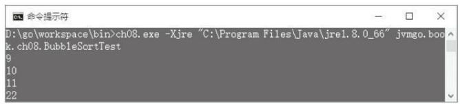
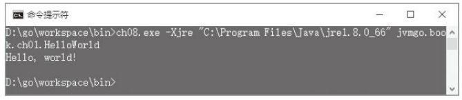
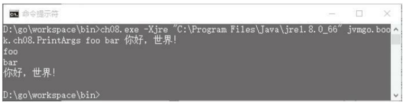

第8章 数组和字符串 
---
在大部分编程语言中，数组和字符串都是最基本的数据类型Java虚拟机直接支持数组，对字符串的支持则由java.lang.String和相关的类提供。本章分为两部分，前半部分讨论数组和数组相关指令，后半部分讨论字符串。 

在本章的讨论中，数组 一般指数组对象 ；在不至于引起混淆的情况下，也可能指数组类 ；在其他情况下，会明确指出是数组类还是数组对象 。如果数组的元素是基本类型，就把它叫作基本类型数组 ，否则，数组的元素是引用类型，把它叫作引用类型数组 。基本类型数组肯定都是一维数组 ，如果引用类型数组的元素也是数组，那么它就是多维数组 。 

开始学习本章之前，还是先把目录结构准备好。复制ch07目录，改名为ch08。修改main.go等文件，把import语句中的ch07全都替换成ch08。本章对目录结构没有太大的调整。

#### 8.1 数组概述 
数组在Java虚拟机中是个比较特殊的概念。为什么这么说呢？有下面几个原因： 

首先，数组类和普通的类是不同的。普通的类从class文件中加载，但是数组类由Java虚拟机在运行时生成。数组的类名是左方括号([)+数组元素的类型描述符；数组的类型描述符就是类名本身。例如，int[]的类名是[I，int[][]的类名是[[I，Object[]的类名是[Ljava /lang/Object；，String[][]的类名是[[java/lang/String；，等等。 

其次，创建数组的方式和创建普通对象的方式不同。普通对象由new指令创建，然后由构造函数初始化。基本类型数组由newarray指令创建；引用类型数组由anewarray指令创建；另外还有一个专门的multianewarray指令用于创建多维数组。 

最后，很显然，数组和普通对象存放的数据也是不同的。普通对象中存放的是实例变量，通过putfield和getfield指令存取。数组对象中存放的则是数组元素，通过`<t>aload`和`<t>astore`系列指令按索引存取。其中`<t>`可以是a、b、c、d、f、i、l或者s，分别用于存取引用、byte、char、double、float、int、long或short类型的数组。另外，还有一个arraylength指令，用于获取数组长度。 

Java虚拟机规范给了实现者充分的自由来实现数组，下面就动手吧！

#### 8.2 数组实现 
将在类和对象的基础上实现数组类和数组对象，先来看数组对象。
##### 8.2.1 数组对象 
和普通对象一样，数组也是分配在堆中的，通过引用来使用。所以需要改造Object结构体，让它既可以表示普通的对象，也可以表示数组。打开ch08\rtda\heap\object.go，修改Object结构体，改动如下：
```go
type Object struct { 
    class *Class 
    data interface{} 
}
```
把fields字段改为data，类型也从Slots变成了interface{}。Go语言的interface{}类型很像C语言中的void*，该类型的变量可以容纳任何类型的值。对于普通对象来说，data字段中存放的仍然还是Slots变量。但是对于数组，可以在其中放各种类型的数组，详见下文。newObject()用来创建普通对象，因此需要做相应的调整，改动如下： 
```go
func newObject(class *Class) *Object { 
    return &Object{ 
        class: class, 
        data: newSlots(class.instanceSlotCount), 
    } 
}
```
因为Fields()方法也仍然只针对普通对象，所以它的代码也需要做相应调整，如下所示： 
```go
func (self *Object) Fields() Slots { 
    return self.data.(Slots) 
}
```
需要给Object结构体添加几个数组特有的方法，为了让代码更加清晰，在单独的文件中定义这些方法。在ch08/rtda/heap目录下创建array_object.go文件，在其中实现8个方法，代码如下：
```go
package heap 
func (self *Object) Bytes() []int8 { return self.data.([]int8) } 
func (self *Object) Shorts() []int16 { return self.data.([]int16) } 
func (self *Object) Ints() []int32 { return self.data.([]int32) } 
func (self *Object) Longs() []int64 { return self.data.([]int64) } 
func (self *Object) Chars() []uint16 { return self.data.([]uint16) } 
func (self *Object) Floats() []float32 { return self.data.([]float32) } 
func (self *Object) Doubles() []float64 { return self.data.([]float64) } 
func (self *Object) Refs() []*Object { return self.data.([]*Object) }
```
上面这8个方法分别针对引用类型数组和7种基本类型数组返回具体的数组数据。继续编辑array_object.go文件，在其中添加ArrayLength()方法，代码如下：
```go
func (self *Object) ArrayLength() int32 { 
    switch self.fields.(type) { 
        case []int8: return int32(len(self.data.([]int8))) 
        case []int16: return int32(len(self.data.([]int16))) 
        case []int32: return int32(len(self.data.([]int32))) 
        case []int64: return int32(len(self.data.([]int64)))
        case []uint16: return int32(len(self.data.([]uint16))) 
        case []float32: return int32(len(self.data.([]float32))) 
        case []float64: return int32(len(self.data.([]float64))) 
        case []*Object: return int32(len(self.data.([]*Object))) 
        default: panic("Not array!") 
    } 
}
```
读者也许会好奇，为什么返回数组数据的方法有8个，但却只有一个统一的ArrayLength()方法呢？答案是，这些方法主要是供`<t>aload`、`<t>astore`和arraylength指令使用的。`<t>aload`和`<t>astore`系列指令各有8条，所以针对每种类型都提供一个方法，返回相应的数组数据。因为arraylength指令只有一条，所以ArrayLength()方法需要自己判断数组类型。

那么为什么没有实现Booleans()方法呢？因为将使用[]int8来表示布尔数组，所以只需要Bytes()方法即可。心急的读者可以先跳到8.3小节，看看数组相关指令是如何实现的。下面实现数组类。
##### 8.2.2 数组类 
不需要修改Class结构体，只给它添加几个数组特有的方法即可。为了强调这些方法只针对数组类，同时也避免class.go文件变得过长，把这些方法定义在新的文件中。 

在ch08/rtda/heap目录下创建array_class.go文件，在其中定义NewArray()方法，代码如下：
```go
func (self *Class) NewArray(count uint) *Object { 
    if !self.IsArray() { 
        panic("Not array class: " + self.name) 
    }
    switch self.Name() { 
        case "[Z": return &Object{self, make([]int8, count)} 
        case "[B": return &Object{self, make([]int8, count)} 
        case "[C": return &Object{self, make([]uint16, count)} 
        case "[S": return &Object{self, make([]int16, count)} 
        case "[I": return &Object{self, make([]int32, count)} 
        case "[J": return &Object{self, make([]int64, count)} 
        case "[F": return &Object{self, make([]float32, count)} 
        case "[D": return &Object{self, make([]float64, count)} 
        default: return &Object{self, make([]*Object, count)} 
    }
}
```
NewArray()方法专门用来创建数组对象。如果类并不是数组类，就调用panic()函数终止程序执行，否则根据数组类型创建数组对象。注意：布尔数组是使用字节数组来表示的。继续编辑array_class.go，在其中定义IsArray()方法，代码如下：
```go
func (self *Class) IsArray() bool { 
    return self.name[0] == '[' 
}
```
还会在array_class.go文件中实现其他几个方法，等用到时再介绍。下面修改类加载器，让它可以加载数组类。
##### 8.2.3 加载数组类 
打开ch08\rtda\heap\class_loader.go文件，修改LoadClass()方法，改动如下： 
```go
func (self *ClassLoader) LoadClass(name string) *Class { 
    if class, ok := self.classMap[name]; ok { 
        return class // 已经加载 
    }
    if name[0] == '[' { 
        return self.loadArrayClass(name) 
    }
    return self.loadNonArrayClass(name) 
}
```
这里增加了类型判断，如果要加载的类是数组类，则调用新的loadArrayClass()方法，否则还按照原来的逻辑。loadArrayClass()方法需要生成一个Class结构体实例，代码如下：
```go
func (self *ClassLoader) loadArrayClass(name string) *Class { 
    class := &Class{ 
        accessFlags: ACC_PUBLIC, // todo 
        name: name, 
        loader: self, 
        initStarted: true, 
        superClass: self.LoadClass("java/lang/Object"), 
        interfaces: []*Class{ 
            self.LoadClass("java/lang/Cloneable"), 
            self.LoadClass("java/io/Serializable"), 
        }, 
    }
    self.classMap[name] = class 
    return class 
}
```
前面三个字段的值比较好理解，不多解释。因为数组类不需要初始化，所以把initStarted字段设置成true。数组类的超类是java.lang.Object，并且实现了java.lang. -Cloneable和java.io.Serializable接口。类加载器改造完毕，下面来实现数组相关指令。
#### 8.3 数组相关指令 
本节要实现20条指令，其中newarray、anewarray、 multianewarray和arraylength指令属于引用类指令；`<t>aload`和`<t>astore`系列指令各有8条，分别属于加载类和存储类指令。下面的Java程序演示了部分数组相关指令的用处。
```java
public class ArrayDemo {
    public static void main(String[] args) { 
        int[] a1 = new int[10]; // newarray 
        String[] a2 = new String[10]; // anewarray 
        int[][] a3 = new int[10][10]; // multianewarray 
        int x = a1.length; // arraylength 
        a1[0] = 100; // iastore 
        int y = a1[0]; // iaload 
        a2[0] = "abc"; // aastore 
        String s = a2[0]; // aaload 
    } 
}
```
下面从newarray指令开始。
##### 8.3.1 newarray指令 
newarray指令用来创建基本类型数组，包括boolean[]、byte[]、char[]、short[]、int[]、long[]、float[]和double[]8种。

在ch08\instructions\references目录下创建newarray.go，在其中定义newarray指令，代码如下：
```go
package references 
import "jvmgo/ch08/instructions/base" 
import "jvmgo/ch08/rtda" 
import "jvmgo/ch08/rtda/heap" 
const (...) // atype常量 
// Create new array of primitive 
type NEW_ARRAY struct { 
    atype uint8 
}
```
newarray指令需要两个操作数。第一个操作数是一个uint8整数，在字节码中紧跟在指令操作码后面，表示要创建哪种类型的数组。Java虚拟机规范把这个操作数叫作atype，并且规定了它的有效值。把这些值定义为常量，代码如下：
```go
const ( 
    AT_BOOLEAN = 4 
    AT_CHAR = 5 
    AT_FLOAT = 6 
    AT_DOUBLE = 7 
    AT_BYTE = 8 
    AT_SHORT = 9AT_INT = 10 
    AT_LONG = 11 
)
```
FetchOperands()方法读取atype的值，代码如下：
```go
func (self *NEW_ARRAY) FetchOperands(reader *base.BytecodeReader) { 
    self.atype = reader.ReadUint8() 
} 
```
newarray指令的第二个操作数是count，从操作数栈中弹出，表示数组长度。Execute()方法根据atype和count创建基本类型数组，代码如下：
```go
func (self *NEW_ARRAY) Execute(frame *rtda.Frame) { 
    stack := frame.OperandStack() 
    count := stack.PopInt() 
    if count < 0 { 
        panic("java.lang.NegativeArraySizeException") 
    }
    classLoader := frame.Method().Class().Loader() 
    arrClass := getPrimitiveArrayClass(classLoader, self.atype) 
    arr := arrClass.NewArray(uint(count)) 
    stack.PushRef(arr) 
} 
```
如果count小于0，则抛出NegativeArraySizeException异常，否则根据atype值使用当前类的类加载器加载数组类，然后创建数组对象并推入操作数栈。getPrimitiveArray -Class()函数的代码如下：
```go
func getPrimitiveArrayClass(loader *heap.ClassLoader, atype uint8) *heap.Class { 
    switch atype {case AT_BOOLEAN: return loader.LoadClass("[Z") 
        case AT_BYTE: return loader.LoadClass("[B") 
        case AT_CHAR: return loader.LoadClass("[C") 
        case AT_SHORT: return loader.LoadClass("[S") 
        case AT_INT: return loader.LoadClass("[I") 
        case AT_LONG: return loader.LoadClass("[J") 
        case AT_FLOAT: return loader.LoadClass("[F") 
        case AT_DOUBLE: return loader.LoadClass("[D") 
        default: panic("Invalid atype!") 
    } 
}
```
下面实现anewarray指令。
##### 8.3.2 anewarray指令 
anewarray指令用来创建引用类型数组。在ch08\instructions\references目录下创建anewarray.go文件，在其中定义anewarray指令，代码如下：
```go
package references 
import "jvmgo/ch08/instructions/base" 
import "jvmgo/ch08/rtda" 
import "jvmgo/ch08/rtda/heap" 
// Create new array of reference 
type ANEW_ARRAY struct{ base.Index16Instruction }
```
anewarray指令也需要两个操作数。第一个操作数是uint16索引，来自字节码。通过这个索引可以从当前类的运行时常量池中找到一个类符号引用，解析这个符号引用就可以得到数组元素的类。第二个操作数是数组长度，从操作数栈中弹出。Execute()方法根据数组元素的类型和数组长度创建引用类型数组，代码如下：
```go
func (self *ANEW_ARRAY) Execute(frame *rtda.Frame) { 
    cp := frame.Method().Class().ConstantPool() 
    classRef := cp.GetConstant(self.Index).(*rtc.ClassRef) 
    componentClass := classRef.ResolvedClass() 
    stack := frame.OperandStack() 
    count := stack.PopInt() 
    if count < 0 { 
        panic("java.lang.NegativeArraySizeException") 
    }
    arrClass := componentClass.ArrayClass() 
    arr := arrClass.NewArray(uint(count)) 
    stack.PushRef(arr)
} 
```
上面的代码比较容易理解，这里就不详细解释了。Class结构体的ArrayClass()方法返回与类对应的数组类，代码在class.go文件中，如下所示：
```go
func (self *Class) ArrayClass() *Class { 
    arrayClassName := getArrayClassName(self.name) 
    return self.loader.LoadClass(arrayClassName) 
}
```
先根据类名得到数组类名，然后调用类加载器加载数组类即可。在ch08\rtda\heap目录下创建class_name_helper.go文件，在其中实现getArrayClassName()函数，代码如下：
```go
package heap 
func getArrayClassName(className string) string { 
    return "[" + toDescriptor(className) 
}
```
把类名转变成类型描述符，然后在前面加上方括号即可。在class_name_helper.go文件中实现toDescriptor()函数，代码如下：
```go
func toDescriptor(className string) string { 
    if className[0] == '[' { 
        return className 
    }
    if d, ok := primitiveTypes[className]; ok { 
        return d 
    }
    return "L" + className + ";" 
}
```
如果是数组类名，描述符就是类名，直接返回即可。如果是基本类型名，返回对应的类型描述符，否则肯定是普通的类名，前面加上方括号，结尾加上分号即可得到类型描述符。primitiveTypes变量也在class_name_helper.go文件中定义，代码如下：
```go
var primitiveTypes = map[string]string{ 
    "void": "V", 
    "boolean": "Z", 
    "byte": "B", 
    "short": "S", 
    "int": "I", 
    "long": "J", 
    "char": "C", 
    "float": "F", 
    "double": "D", 
}
```
除了newarray和anewarray，还有一个multianewarray指令，专门用来创建多维数组。这个指令比较复杂，放到最后实现。下面来看arraylength指令。
##### 8.3.3 arraylength指令 
arraylength指令用于获取数组长度。在ch08\instructions\references目录下创建arraylength.go，在其中定义arraylength指令，代码如下：
```go
package references 
import "jvmgo/ch08/instructions/base" 
import "jvmgo/ch08/rtda" 
// Get length of array 
type ARRAY_LENGTH struct{ base.NoOperandsInstruction }
```
arraylength指令只需要一个操作数，即从操作数栈顶弹出的数组引用。Execute()方法把数组长度推入操作数栈顶，代码如下：
```go
func (self *ARRAY_LENGTH) Execute(frame *rtda.Frame) { 
    stack := frame.OperandStack() 
    arrRef := stack.PopRef() 
    if arrRef == nil { 
        panic("java.lang.NullPointerException") 
    }
    arrLen := arrRef.ArrayLength() 
    stack.PushInt(arrLen) 
}
```
如果数组引用是null，则需要抛出NullPointerException异常，否则取数组长度，推入操作数栈顶即可。下面实现`<t>aload`和`<t>astore`系列指令。
##### 8.3.4 `<t>aload`指令 
`<t>aload`系列指令按索引取数组元素值，然后推入操作数栈。在ch08\instructions \loads目录下创建xaload.go文件，在其中定义8条指令，代码如下：
```go
package loads 
import "jvmgo/ch08/instructions/base" 
import "jvmgo/ch08/rtda" 
import "jvmgo/ch08/rtda/heap" 
type AALOAD struct{ base.NoOperandsInstruction } 
type BALOAD struct{ base.NoOperandsInstruction } 
type CALOAD struct{ base.NoOperandsInstruction } 
type DALOAD struct{ base.NoOperandsInstruction } 
type FALOAD struct{ base.NoOperandsInstruction } 
type IALOAD struct{ base.NoOperandsInstruction } 
type LALOAD struct{ base.NoOperandsInstruction } 
type SALOAD struct{ base.NoOperandsInstruction }
```
这8条指令的实现大同小异，为了节约篇幅，以aaload指令为例进行说明。其Execute()方法如下： 
```go
func (self *AALOAD) Execute(frame *rtda.Frame) { 
    stack := frame.OperandStack() 
    index := stack.PopInt() 
    arrRef := stack.PopRef() 
    checkNotNil(arrRef) 
    refs := arrRef.Refs() 
    checkIndex(len(refs), index) 
    stack.PushRef(refs[index]) 
}
```
首先从操作数栈中弹出第一个操作数：数组索引，然后弹出第二个操作数：数组引用。如果数组引用是null，则抛出NullPointerException异常。这个判断在checkNotNil()函数中，代码如下：
```go
func checkNotNil(ref *heap.Object) { 
    if ref == nil { 
        panic("java.lang.NullPointerException") 
    } 
}
```
如果数组索引小于0，或者大于等于数组长度，则抛出ArrayIndexOutOfBoundsExcep
-tion。这个检查在checkIndex()函数中，代码如下：
```go
func checkIndex(arrLen int, index int32) { 
    if index < 0 || index >= int32(arrLen) { 
        panic("ArrayIndexOutOfBoundsException") 
    } 
}
```
如果一切正常，则按索引取出数组元素，推入操作数栈顶。
##### 8.3.5 `<t>astore`指令 
`<t>astore`系列指令按索引给数组元素赋值。在ch08\instructions\stores目录下创建xastore.go文件，在其中定义8条指令，代码如下：
```go
package stores 
import "jvmgo/ch08/instructions/base" 
import "jvmgo/ch08/rtda" 
import "jvmgo/ch08/rtda/heap" 
type AASTORE struct{ base.NoOperandsInstruction } 
type BASTORE struct{ base.NoOperandsInstruction } 
type CASTORE struct{ base.NoOperandsInstruction } 
type DASTORE struct{ base.NoOperandsInstruction } 
type FASTORE struct{ base.NoOperandsInstruction } 
type IASTORE struct{ base.NoOperandsInstruction } 
type LASTORE struct{ base.NoOperandsInstruction } 
type SASTORE struct{ base.NoOperandsInstruction }
```
这8条指令的实现是大同小异，以iastore为例进行说明，其Execute()方法如下： 
```go
func (self *IASTORE) Execute(frame *rtda.Frame) { 
    stack := frame.OperandStack() 
    val := stack.PopInt() 
    index := stack.PopInt() 
    arrRef := stack.PopRef() 
    checkNotNil(arrRef) 
    ints := arrRef.Ints() 
    checkIndex(len(ints), index) 
    ints[index] = int32(val) 
}
```
iastore指令的三个操作数分别是：要赋给数组元素的值、数组索引、数组引用，依次从操作数栈中弹出。如果数组引用是null，则抛出NullPointerException。如果数组索引小于0或者大于等于数组长度，则抛出ArrayIndexOutOfBoundsException异常。这两个检查和`<t>aload`系列指令一样。如果一切正常，则按索引给数组元素赋值。`<t>aload`和`<t>astore`指令实现好了，下面来看multianewarray指令。
##### 8.3.6 multianewarray指令 
multianewarray指令创建多维数组。在ch08\instructions\references目录下创建multianewarray.go文件，在其中定义multianewarray指令，代码如下所示： 
```go
package references 
import "jvmgo/ch08/instructions/base" 
import "jvmgo/ch08/rtda" 
import "jvmgo/ch08/rtda/heap" 
// Create new multidimensional array 
type MULTI_ANEW_ARRAY struct { 
    index uint16 
    dimensions uint8 
}
```
multianewarray指令的第一个操作数是个uint16索引，通过这个索引可以从运行时常量池中找到一个类符号引用，解析这个引用就可以得到多维数组类。第二个操作数是个uint8整数，表示数组维度。这两个操作数在字节码中紧跟在指令操作码后面，由Fetch -Operands()方法读取，代码如下：
```go
func (self *MULTI_ANEW_ARRAY) FetchOperands(reader *base.BytecodeReader) { 
    self.index = reader.ReadUint16() 
    self.dimensions = reader.ReadUint8() 
}
```
multianewarray指令还需要从操作数栈中弹出n个整数，分别代表每一个维度的数组长度。Execute()方法根据数组类、数组维度和各个维度的数组长度创建多维数组，代码如下：
```go
func (self *MULTI_ANEW_ARRAY) Execute(frame *rtda.Frame) { 
    cp := frame.Method().Class().ConstantPool() 
    classRef := cp.GetConstant(uint(self.index)).(*heap.ClassRef) 
    arrClass := classRef.ResolvedClass() 
    stack := frame.OperandStack() 
    counts := popAndCheckCounts(stack, int(self.dimensions)) 
    arr := newMultiDimensionalArray(counts, arrClass) 
    stack.PushRef(arr) 
}
```
这里提醒读者注意，在anewarray指令中，解析类符号引用后得到的是数组元素的类，而这里解析出来的直接就是数组类。
popAndCheckCounts()函数从操作数栈中弹出n个int值，并且确保它们都大于等于0。如果其中任何一个小于0，则抛出NegativeArraySizeException异常。代码如下：
```go
func popAndCheckCounts(stack *rtda.OperandStack, dimensions int) []int32 { 
    counts := make([]int32, dimensions) 
    for i := dimensions - 1; i >= 0; i-- { 
        counts[i] = stack.PopInt() 
        if counts[i] < 0 { 
            panic("java.lang.NegativeArraySizeException") 
        } 
    }
    return counts 
}
```
newMultiArray()函数创建多维数组，代码如下：
```go
func newMultiDimensionalArray(counts []int32, arrClass *heap.Class) *heap.Object { 
    count := uint(counts[0]) 
    arr := arrClass.NewArray(count) 
    if len(counts) > 1 { 
        refs := arr.Refs() 
        for i := range refs { 
            refs[i] = newMultiDimensionalArray (counts[1:], 		arrClass.ComponentClass()) 
        } 
    }
    return arr 
}
```
Class结构体的ComponentClass()方法返回数组类的元素类型在array_class.go文件中，代码如下：
```go
func (self *Class) ComponentClass() *Class { 
    componentClassName := getComponentClassName(self.name) 
    return self.loader.LoadClass(componentClassName) 
}
```
ComponentClass()方法先根据数组类名推测出数组元素类名，然后用类加载器加载元素类即可。getComponentClassName()函数在ch08\rtda\heap\class_name_helper.go文件中，代码如下：
```go
func getComponentClassName(className string) string { 
    if className[0] == '[' { 
        componentTypeDescriptor := className[1:] 
        return toClassName(componentTypeDescriptor) 
    }
    panic("Not array: " + className) 
}
```
数组类名以方括号开头，把它去掉就是数组元素的类型描述符，然后把类型描述符转成类名即可。toClassName()函数也在class_name_helper.go文件中，代码如下：
```go
func toClassName(descriptor string) string { 
    if descriptor[0] == '[' { // array 
        return descriptor 
    }
    if descriptor[0] == 'L' { // object 
        return descriptor[1 : len(descriptor)-1] 
    }
    for className, d := range primitiveTypes { 
        if d == descriptor { // primitive 
            return className 
        } 
    }
    panic("Invalid descriptor: " + descriptor) 
}
```
如果类型描述符以方括号开头，那么肯定是数组，描述符即是类名。如果类型描述符以L开头，那么肯定是类描述符，去掉开头的L和末尾的分号即是类名，否则判断是否是基本类型的描述符，如果是，返回基本类型名称，否则调用panic()函数终止程序执行。 
至此，multianewarray终于解释完了。由于该指令比较难理解，用一个例子分析。 
```java
public void test() { 
    int[][][] x = new int[3][4][5]; 
}
```
上面的Java方法创建了一个三维数组，编译之后的字节码如下：
```go
00 iconst_3 
01 iconst_4 
02 iconst_5 
03 multianewarray #5 // [[[I, 3 
07 astore_1 
08 return 
```
编译器先生成了三条iconst_n指令，然后又生成了一条multianewarray指令，剩下的两条指令和数组创建无关。multianewarray指令的第一个操作数是5，是个类引用，类名是[[[I，说明要创建的是int[][][]数组。第二个操作数是3，说明要创建三维数组。

当方法执行时，三条iconst_n指令先后把整数3、4、5推入操作数栈顶。multianewarray指令在解码时就已经拿到常量池索引(5)和数组维度(3)。在执行时，它先查找运行时常量池索引，知道要创建的是int[][][]数组，接着从操作数栈中弹出三个int值，依次是5、4、3。现在multianewarray指令拿到了全部信息，从最外维开始创建数组实例即可。专门用于数组的指令实现好了，但别忘了还需要修改ch08\instructions\factory.go文件，在其中添加这些指令的case语句。改动比较简单，这里就不给出代码了。下面修改instanceof和checkcast，让这两条指令可以正确用于数组对象。

##### 8.3.7 完善instanceof和checkcast指令
虽然说是完善instanceof和checkcast指令，但实际上这两条指令的代码都没有任何变化。需要修改的是ch08\rtda\heap\class_hierarchy.go文件中的isAssignableFrom()方法，而且改动很大，代码如下：
```go
func (self *Class) isAssignableFrom(other *Class) bool { 
    s, t := other, self 
    if s == t { 
        return true 
    }
    if !s.IsArray() { 
        if !s.IsInterface() { 
            if !t.IsInterface() { 
                return s.IsSubClassOf(t) 
            } else { 
                return s.IsImplements(t) 
            } 
        } else { 
            if !t.IsInterface() { 
                return t.isJlObject() 
            } else { 
                return t.isSuperInterfaceOf(s) 
            } 
        } 
    } else { 
        if !t.IsArray() { 
            if !t.IsInterface() { 
                return t.isJlObject() 
            } else { 
                return t.isJlCloneable() || t.isJioSerializable() 
            } 
        } else { 
            sc := s.ComponentClass() 
            tc := t.ComponentClass() 
            return sc == tc || tc.isAssignableFrom(sc) 
        } 
    }
    return false 
}
```
注意，粗体部分是原来的代码，其余都是新增代码。由于篇幅限制，就不详细解释这个函数了，请读者阅读Java虚拟机规范的8.6.5节对instanceof和checkcast指令的描述。需要注意的是：
- ·数组可以强制转换成Object类型(因为数组的超类是Object)。 
- ·数组可以强制转换成Cloneable和Serializable类型(因为数组实现了这两个接口)。 
- ·如果下面两个条件之一成立，类型为[]SC的数组可以强制转换成类型为[]TC的数组： 
- ·TC和SC是同一个基本类型。 
- ·TC和SC都是引用类型，且SC可以强制转换成TC。
#### 8.4 测试数组 
数组相关的内容差不多都准备好了，下面用经典的冒泡排序算法测试。 
```java
package jvmgo.book.ch08; 
public class BubbleSortTest { 
    public static void main(String[] args) { 
        int[] arr = {22, 84, 77, 11, 95, 9, 78, 56, 36, 97, 65, 36, 10, 24 ,92, 48}; 
        bubbleSort(arr); 
        printArray(arr); 
    }
    private static void bubbleSort(int[] arr) { 
        boolean swapped = true; 
        int j = 0; 
        int tmp; 
        while (swapped) { 
            swapped = false; 
            j++; 
            for (int i = 0; i < arr.length - j; i++) { 
                if (arr[i] > arr[i + 1]) { 
                    tmp = arr[i]; 
                    arr[i] = arr[i + 1]; 
                    arr[i + 1] = tmp; 
                    swapped = true; 
                } 
            } 
        } 
    }
    private static void printArray(int[] arr) { 
        for (int i : arr) { 
            System.out.println(i); 
        } 
    } 
}
```
打开命令行窗口，执行下面的命令编译本章代码：
```shell script
go install jvmgo\ch08
```
命令执行完毕后，在D：\go\workspace\bin目录下出现ch08.exe文件。用javac编译，然后用ch08.exe执行BubbleSortTest类，结果如图8-1所示。 
  
图8-1 BubbleSortTest程序执行结果

#### 8.5 字符串 
在class文件中，字符串是以MUTF8格式保存的，这一点在3.3.7节讨论过。在Java虚拟机运行期间，字符串以java.lang.String(后面简称String)对象的形式存在，而在String对象内部，字符串又是以UTF16格式保存的。字符串相关功能大部分都是由String(和StringBuilder等)类提供的，本节只实现一些辅助功能即可。 

String类有两个实例变量。其中一个是value，类型是字符数组，用于存放UTF16编码后的字符序列。另一个是hash，缓存计字符串的哈希码，代码如下：
```go
package java.lang; 
public final class String 
implements java.io.Serializable, Comparable<String>, CharSequence { 
    /** The value is used for character storage. */ 
    private final char value[]; 
    /** Cache the hash code for the string */ 
    private int hash; // Default to 0 
    ... // 其他代码 
}
```
字符串对象是不可变(immutable)的，一旦构造好之后，就无法再改变其状态(这里指value字段)。String类有很多构造函数，其中一个是根据字符数组来创建String实例，代码如下：
```java
public String(char value[]) { 
    this.value = Arrays.copyOf(value, value.length); 
}
```
本节将参考上面的构造函数，直接创建String实例。为了节约内存，Java虚拟机内部维护了一个字符串池。String类提供了intern()实例方法，可以把自己放入字符串池。代码如下： 
```java
public native String intern();
``` 
本节将实现字符串池，由于intern()是本地方法，所以留到第9章实现。
##### 8.5.1 字符串池 
在ch08\rtda\heap目录下创建string_pool.go文件，在其中定义internedStrings变量，代码如下：
```go
package heap 
import "unicode/utf16" 
var internedStrings = map[string]*Object{} 
用map来表示字符串池，key是Go字符串，value是Java字符串。继续编辑string_po -ol.go文件，在其中实现JString()函数，代码如下：
```go
func JString(loader *ClassLoader, goStr string) *Object { 
    if internedStr, ok := internedStrings[goStr]; ok { 
        return internedStr 
    }
    chars := stringToUtf16(goStr) 
    jChars := &Object{loader.LoadClass("[C"), chars} 
    jStr := loader.LoadClass("java/lang/String").NewObject() 
    jStr.SetRefVar("value", "[C", jChars) 
    internedStrings[goStr] = jStr 
    return jStr 
}
```
JString()函数根据Go字符串返回相应的Java字符串实例。如果Java字符串已经在池中，直接返回即可，否则先把Go字符串(UTF8格式)转换成Java字符数组(UTF16格式)，然后创建一个Java字符串实例，把它的value变量设置成刚刚转换而来的字符数组，最后把Java字符串放入池中。注意，这里其实是跳过了String的构造函数，直接用hack的方式创建实例。在前面分析过String类的代码，这样做虽然有点投机取巧，但确实是没有问题的。
继续编辑string_pool.go文件文件，实现stringToUtf16()函数，代码如下：
```go
func stringToUtf16(s string) []uint16 { 
    runes := []rune(s) // utf32 
    return utf16.Encode(runes) 
}
```
Go语言字符串在内存中是UTF8编码的，先把它强制转成UTF32，然后调用utf16包的Encode()函数编码成UTF16。Object结构体的SetRefVar()方法直接给对象的引用类型实例变量赋值，代码如下(在object.go文件中)：
```go
func (self *Object) SetRefVar(name, descriptor string, ref *Object) { 
    field := self.class.getField(name, descriptor, false) 
    slots := self.data.(Slots) 
    slots.SetRef(field.slotId, ref) 
}
```
Class结构体的getField()函数根据字段名和描述符查找字段，代码如下(代码在class.go文件中)：
```go
func (self *Class) getField(name, descriptor string, isStatic) *Field { 
    for c := self; c != nil; c = c.superClass { 
        for _, field := range c.fields { 
            if field.IsStatic() == isStatic && field.name == name && field.descriptor == descriptor { 
                return field 
            } 
        } 
    }
    return nil 
}
```
字符串池实现好了，下面修改ldc指令和类加载器，让它们支持字符串。
##### 8.5.2 完善ldc指令 
打开ch08\instructions\constants\ldc.go文件，添加一条import语句，代码如下：
```go
package constants 
import "jvmgo/ch08/instructions/base" 
import "jvmgo/ch08/rtda" 
import "jvmgo/ch08/rtda/heap" 

然后修改_ldc()函数，改动如下：
func _ldc(frame *rtda.Frame, index uint) { 
    stack := frame.OperandStack() 
    class := frame.Method().Class() 
    c := class.ConstantPool().GetConstant(index) 
    switch c.(type) { 
        case int32: stack.PushInt(c.(int32)) 
        case float32: stack.PushFloat(c.(float32)) 
        case string: 
            internedStr := heap.JString(class.Loader(), c.(string)) 
            stack.PushRef(internedStr) 
    ... // 其他代码不变 
}
```
如果ldc试图从运行时常量池中加载字符串常量，则先通过常量拿到Go字符串，然后把它转成Java字符串实例并把引用推入操作数栈顶。
##### 8.5.3 完善类加载器 
打开ch08\rtda\heap\class_loader.go文件，修改initStaticFinalVar函数，改动如下：
```go
func initStaticFinalVar(class *Class, field *Field) { 
    vars := class.staticVars 
    cp := class.constantPool 
    cpIndex := field.ConstValueIndex() 
    slotId := field.SlotId() 
    if cpIndex > 0 { 
        switch field.Descriptor() { 
            ... // 其他 
            case语句不变 
            case "Ljava/lang/String;": 
                goStr := cp.GetConstant(cpIndex).(string) 
                jStr := JString(class.Loader(), goStr) 
                vars.SetRef(slotId, jStr) 
        } 
    } 
}
```
这里增加了字符串类型静态常量的初始化逻辑，代码比较简单，就不多解释了。至此，字符串相关的工作都做完了，下面进行测试。
#### 8.6 测试字符串 
打开ch08\main.go文件，修改startJVM()函数。改动非常小，只是在调用interpret()函数时，把传递给Java主方法的参数传递给它，代码如下：
```go
func startJVM(cmd *Cmd) { 
    ... // 其他代码不变 
    if mainMethod != nil { 
        interpret(mainMethod, cmd.verboseInstFlag, cmd.args) 
    } else { 
        fmt.Printf("Main method not found in class %s\n", cmd.class) 
    } 
}
```
打开interpreter.go文件，修改interpret()函数，改动如下： 
```go
func interpret(method *heap.Method, logInst bool, args []string) { 
    thread := rtda.NewThread() 
    frame := thread.NewFrame(method) 
    thread.PushFrame(frame) 
    jArgs := createArgsArray(method.Class().Loader(), args) 
    frame.LocalVars().SetRef(0, jArgs) 
    defer catchErr(thread) 
    loop(thread, logInst) 
} 
```
interpret()函数接收从startJVM()函数中传递过来的args参数，然后调用createArgs -Array()函数把它转换成Java字符串数组，最后把这个数组推入操作数栈顶。至此，通过命令行传递给Java程序的参数终于可以派上用场了！createArgsArray()函数的代码如下：
```go
func createArgsArray(loader *heap.ClassLoader, args []string) *heap.Object { 
    stringClass := loader.LoadClass("java/lang/String") 
    argsArr := stringClass.ArrayClass().NewArray(uint(len(args))) 
    jArgs := argsArr.Refs() 
    for i, arg := range args { 
        jArgs[i] = heap.JString(loader, arg) 
    }
    return argsArr 
}
```
最后，打开ch08\instructions\references\invokevirtual.go，修改_println()函数，让它可以打印字符串，改动如下：
```go
// hack! 
func _println(stack *rtda.OperandStack, descriptor string) { 
    switch descriptor { 
        ... // 其他 
        case语句不变 
        case "(Ljava/lang/String;)V": 
            jStr := stack.PopRef() 
            goStr := heap.GoString(jStr) 
            fmt.Println(goStr) 
    ... // 其他代码不变 
}
```
GoString()函数在string_pool.go文件中，代码如下：
```go
func GoString(jStr *Object) string { 
    charArr := jStr.GetRefVar("value", "[C")return utf16ToString(charArr.Chars()) 
}
``` 
先拿到String对象的value变量值，然后把字符数组转换成Go字符串。Object结构体的GetRefVar()方法(在object.go文件中)如下：
```go
func (self *Object) GetRefVar(name, descriptor string) *Object { 
    field := self.class.getField(name, descriptor, false) 
    slots := self.data.(Slots) 
    return slots.GetRef(field.slotId) 
}
```
utf16ToString()函数在string_pool.go文件中，代码如下：
```go
func utf16ToString(s []uint16) string { 
    runes := utf16.Decode(s) // utf8 
    return string(runes) 
}
```
先把UTF16数据转换成UTF8编码，然后强制转换成Go字符串即可。一切就绪！重新编译本章代码，然后用ch08.exe执行在第1章就已经出现过的HelloWorld程序。 
```java
package jvmgo.book.ch01; 
public class HelloWorld { 
    public static void main(String[] args) { 
        System.out.println("Hello, world!"); 
    } 
}
```
久违的“Hello，world！”终于出现在控制台上了，如图8-2所示。
   
图8-2 HelloWorld程序执行结果 


再执行一个稍微复杂一些的程序：
```java
package jvmgo.book.ch08; 
public class PrintArgs { 
    public static void main(String[] args) { 
        for (String arg : args) { 
            System.out.println(arg); 
        } 
    } 
}
```
执行结果如图8-3所示。 
  
图8-3 PrintArgs程序执行结果
#### 8.7 本章小结 
本章实现了数组和字符串，在本章的结尾，终于可以运行HelloWorld程序了。不过美中不足的是，我们并不是通过调用System.out.println()方法，而是通过hack的方式打印的。请读者不要着急，下一章会讨论本地方法调用，第10章会讨论异常处理。到了第11章，将最终去掉这个hack，让println()方法真正得以调用！
